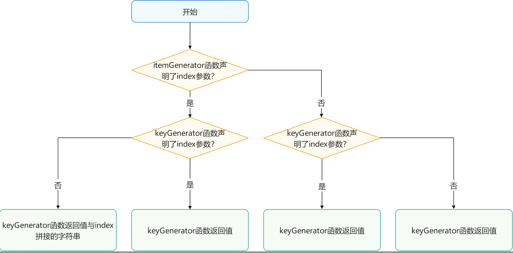

# HarmonyOS NEXT 学习总结

### 声明式开发范式

声明式UI是系统选用的新一代开发范式，通过数据驱动UI变化，UI逻辑分离，更直观，更高效

### 丰富的UI组件

基础组件，布局容器组件，导航组件

### @Entry装饰器

表明组件是一个入口页面，可以通过 UIAbility 进行加载，也可以通过路由来访问

### @Component装饰器

声明一个自定义组件

### @State装饰器

用于状态变量的定义

### struct

用于定义自定义组件 如`struct ToDoList`

### build 函数

build 函数内部进行相应的声明式UI描述

### 组件的生命周期函数（通过@Component装饰器装饰的函数）

1. 当组件即将出现时，回调该函数 aboutToAppear
2. 每次页面显示时触发一次 onPageShow (注意，该函数的回调，仅在被@Entry装饰的自定义组件生效)
3. 点击了返回按钮时，或者侧滑返回时 触发
4. 隐藏页面触发一次，如 在路由跳转过程中，或者应用进入后台等情况 onPageHide (
   注意，该函数的回调，仅在被@Entry装饰的自定义组件生效)
5. 当组件被销毁前触发回调 aboutToDisappear

### @Prop
子组件接收父组件传入的参数。和vue中父子传参用prop接收一样。但是是否允许修改，还没有看到（设计上应该是不允许修改。需要通过，通知的方式）

### @Link
子组件接收父组件传入的参数，子组件中修改了对应的参数，父组件中的值也进行了相应的修改。
有点像vue中组件中使用v-model。vue3.4后推荐使用`defineModel() 宏`。

这一点比vue2中使用方便

### @Watch('onEditModeChange')
状态变量更改通知，类似于vue中的watch。

#### @Watch的触发时机


### 循环渲染 ForEach

在ForEach循环渲染过程中，系统会为每个数组元素生成一个唯一且持久的键值，
用于标识对应的组件。当这个键值变化时，ArkUI框架将视为该数组元素已被替换或修改，
并会基于新的键值创建一个新的组件。

区别于vue-for，需要自己指定一个唯一键key，用于标识，替换或者修改，根据diff判断进行。

第一个参数：一个数组
第二个参数：是一个函数，里面自定义渲染信息。

```ets
ForEach(this.todoDataList,(item:string)=>{
  // 自定义组件的循环渲染
  ToDoItem({studyName:item,age:10})
},(item:string)=>item)
```

ForEach的键值的生成规则:



和vue中的key有差不多的意义，都是要做最小量更新。

如果itemGenerator中声明了index，那么keyGenerator中必须声明index（我一般不使用，）使用后端返回的ID。

如果itemGenerator中没有声明index，那么keyGenerator中也不需要声明index，使用后端返回的ID。

下面是我的写法：通过id作为键值的判断规则，来渲染页面。

```cts
ForEach(this.todoDataList, (item: IStudy) => {
  // 自定义组件的循环渲染
  ToDoItem({ studyName: item.name, age: 10 })
}, (item: IStudy) => item.id+'')
```

开发者在使用ForEach时应尽量避免最终键值生成规则中包含index。

### @Observed装饰器

用于修饰类的装饰器，配合@ObjectLink装饰器一起使用

### @ObjectLink装饰器

子组件中使用 @ObjectLink装饰器来接收实例（父组件传入的）。这样子组件中的接收的数据和父组件传入的数据共享同一份数据，有点像
vue中的父子组件中使用v-model。这里通过子组件就可以修改父组件中的数据。区别于vue2，类似于vue3.4中的defineModel()，
用于双向绑定prop。

### @Builder 装饰器对组件进行封装
ArkUI提供了一种轻量化的UI复用机制@Builder，可以将重复使用的UI元素抽象成一个方法，然后再build方法内调用
```ets
 @Builder
  newLocalBuilder(text:string) {
    Button() {
      Text(text)
        .font({
          size: 20,
        })
    }
    .width(60)
    .height(60)
  }
```
在build方法内调用
```ets
Row() {
  this.newLocalBuilder('方式1');
  this.newLocalBuilder('方式2');
  this.newLocalBuilder('方式3');
}
```

## 布局

### 线性布局
#### Row
Row容器中的元素都在一行内排列

#### Column
Column中的元素都在多行排列

### Stack层叠布局
类似于css 的 固定定位，举个例子
```ets
  build() {
    Stack() {
      Button() {
        Image($r('app.media.ic_ok'))
          .width(50)
          .height(50)
      }
      .width(60)
      .height(60)
      /*固定定位*/
      .position({x: '50%', y: '85%'})
      /*平移自身宽度的一半*/
      .translate({
        x:'-50%',
      })
    }
  }
```
定位一个按钮到页面视口中的高度85%的位置，左右中间的位置，由于元素存在宽度，需要平移自身宽度的一半即可，
这个和css操作是一样的。

学到这里，有点对声明式UI开发有更加多了感触了。

### ReactiveContainer 相对布局
类似于css 中相对定位和绝对定位。

定位`>`到容器右侧20vp距离，并且居中位置。
```cts
RelativeContainer() {
   Row() {
     Text(item.name)
       .fontSize(16)
       .fontWeight(FontWeight.Bold)
       .fontColor('#f89')

   }
   .width('100%')
   .height('100%')

   .borderWidth({
     left: 0,
     right: 0,
     top: 0,
     bottom: 1
   })
   // .height(200)
   .borderColor('#ddd')
   // .borderRadius(10)

   Text('>')
     .fontSize(16)
     .fontWeight(FontWeight.Bold)
     .fontColor('#ddd')
     .margin({
       right: 20
     })
     .alignRules({
       'top': { 'anchor': '__container__', 'align': VerticalAlign.Center },
       'right': { 'anchor': '__container__', 'align': HorizontalAlign.End }
     })
     .zIndex(2111)
     .translate({
       // x: '-100%',
       y:'-50%'
     })
 }
```

### Flex 弹性布局
感觉简单的，属性的设置和css中的几乎一样，只是位置不同而已，上手方便。


### width('100%')的问题
~~宽度100%不是基于父元素来说的，而是对视口宽度来说的，这样会导致，我想子元素站满父元素的宽度的时候，不好通过100%设置，
解决办法，通过calc 函数动态计算。~~

注意：再次经过测试，以上说法是错误的。

要分情况讨论：
1. 如果父元素有宽度，那么子元素设置宽度100% 指的是相对于父元素来说的100%
2. 如果父元素没有指定宽度，那么子元素设置宽度100% ，那么会向组件树向上寻找设置了，宽度的容器的跨度，在进行百分比计算。

如果元素想占满父元素剩余的宽度，可以通过calc 函数。有没有通过其他方法，暂不清楚。flex布局感觉有办法，等等学到flex再来补充这段内容（TODO）

补充来了，看上面的flex布局，通过子组件设置`flexGrow(1)`来占满父元素剩余宽度。

### 动态计算宽度 使用calc 函数
```ets
.width(`calc(100% - ${40}vp)`)
```

### 对于组件的默认宽度问题的分析
有些组件是有默认宽度的，有些组件没有默认跨度，有些组件的宽度默认会占满父元素的宽度，后续需要一一分析讨论

TODO: 后续遇到再补充。

1. 没有默认宽度的组件：
   - Row
   - Text
   - ListItem
   - image

   
2. 默认会占满父元素的宽度的组件：
   - ListGroup

3. 有默认宽度的组件：
   - xxx


### util.generateRandomUUID
随机生成UUID数据。注意在预览器中和模拟器中的表现不一样。如果需要测试在模拟器或者真机中测试。


### $$语法：内置组件数据双向同步
类似vue中input组件绑定v-model的语法。
```cts
Checkbox()
 /*$$ 支持内置组件数据的双向同步，和v-model相同*/
 .select($$this.todoItem.isChecked)
```

### 如何调试打印对象信息
console.log(JSON.stringify(obj));

### 如何在非安全区域 显示数据
比如：显示通栏的轮播图
.expandSafeArea([SafeAreaType.SYSTEM], [SafeAreaEdge.TOP, SafeAreaEdge.BOTTOM])

expandSafeArea属性仅作用于当前组件，不会向父组件或子组件传递，因此使用过程中，所有相关组件均需配置。

这样的话，需要设置很多的expandSafeArea属性，需要一层层的设置下去


### 设计稿的大小
TODO：需要知道


### axios的使用

#### 安装axios
```
ohpm install @ohos/axios
```
注意：node版本需要大于18，安装的时候会有提示的。

#### 网络请求权限配置
在module.json5文件中配置
```json
{
  "module": {
    "requestPermissions": [
      {
        "name": "ohos.permission.INTERNET"
      }
    ]
  }
}
```

#### 定义axiosConfig.ets文件
```ets
import axios from '@ohos/axios';
//`baseURL`如果`url`不是绝对地址，那么将会加在其前面。
//可以很方便的对相对地址的axios实例设置`baseUrl`。
axios.defaults.baseURL = 'https://www.xxx.com';
```
后续请求拦截器，响应拦截器都可以配置到这里。

用法和在vue中使用相同的。

#### 在入口文件中引用该文件即可，执行副作用


