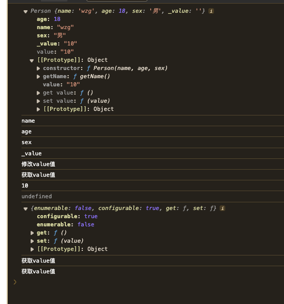

## Class类
constructor关键字用于在类定义块内部创建类的构造函数。方法名为constructor会告诉解释器在使用new操作符创建类的新实例时，应该调用这个函数。

1. 实例化
  使用new调用类的构造函数会执行如下操作：
  - 在内存中创建一个新对象
  - 这个新对象内部的[[Prototype]]指针被赋值为构造函数的prototype属性
  - 构造函数内部的this被赋值为这个新对象（即this指向新对象）
  - 执行构造函数内部的代码（给新对象添加属性）
  - 如果构造函数返回非空对象，则返回该对象；否则返回刚创建的新对象。

> 这4步操作就和`构造函数创建对象`的操作基本上一致

#### 举例
```js
  class Person {
    constructor(name, age, sex) {
      this.name = name;
      this.age = age;
      this.sex = sex;
      this._value = '';
    }
    getName () {
      return this.name;
    }
    get value () {
      console.log('获取value值');
      return this._value;
    }
    set value (value) {
      console.log('修改value值');
      this._value = value;
    }
  }
  let p1 = new Person('wzg', 18, '男');
  console.log(p1);
  for (const key in p1) {
    console.log(key);
  }
  p1.value = 10;
  console.log(p1.value);

  console.log(Object.getOwnPropertyDescriptor(p1, 'value'));
  console.log(Object.getOwnPropertyDescriptor(p1.__proto__, 'value'));

```

#### 对比构造函数
- `constructor`里面的操作，和`构造函数创建对象`的操作基本上一致
- `getName函数`相当于构造函数的原型上新增方法
- `get value`,`set value`,获取和设置访问器相当于实例对象中定义的访问器描述符

#### 几个注意点
1. 打印时，p1对象中为什么会有value属性？p1对象的原型中有value属性，访问器属性？
 - 答：当你打印一个对象时，console.log会遍历对象的所有自有属性（包括数据属性和访问器属性），value属性属于p1对象，还是p1对象的原型可以通过`Object.getOwnPropertyDescriptor`方法进行判断。结论是属于p1对象的原型。

2. 如果value属性属于p1原型，那么原型上的数据共享的，那么岂不是所有的实例化对象的value都相同了？
 - 答：因为value是一个访问器属性，那么获取和修改value属性的时候都会执行`get和set`方法，这个两个方法中，返回的是实例对象中的_value的值，所以获取和修改value，其实是获取和修改实例化对象上的_value值。

## Class类转函数
就以上面的代码为例，进行修改
```js
function Person (name, age, sex) {
  if (!new.target) throw new Error(`这是个构造函数，请使用new关键字创建对象`)
  this.name = name;
  this.age = age;
  this.sex = sex;
  this._value = '';
  Object.defineProperty(Person.prototype, 'value', {
    configurable: true,
    enumerable: false,
    get () {
      console.log('获取value值');
      return this._value;
    },
    set (value) {
      console.log('修改value值');
      this._value = value;
    }
  })
}
Object.defineProperty(Person.prototype, 'getName', {
  configurable: true,
  enumerable: false,
  writable: true,
  value: function getName () {
    return this.name;
  }
})

let p1 = new Person('wzg', 18, '男');
console.log(p1);
for (const key in p1) {
  console.log(key);
}
p1.value = '10';
console.log(p1.value);
console.log(Object.getOwnPropertyDescriptor(p1, 'value'));
console.log(Object.getOwnPropertyDescriptor(p1.__proto__, 'value'));

```
看结果，应该是和class创建的对象的差不多了。



