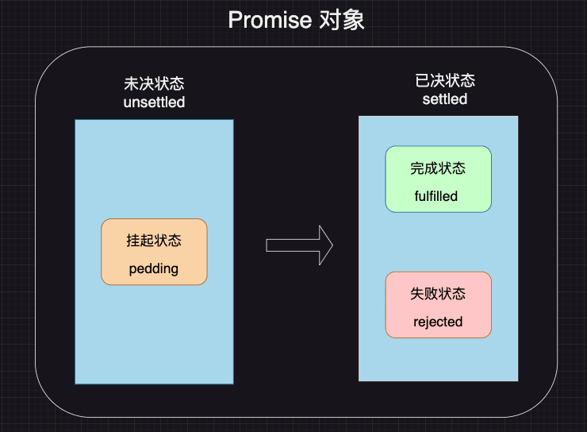
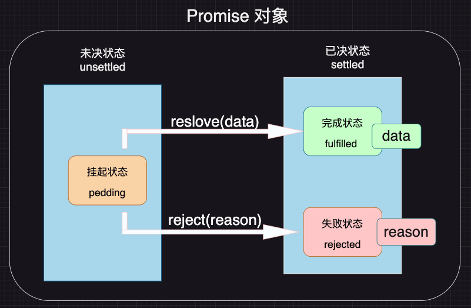
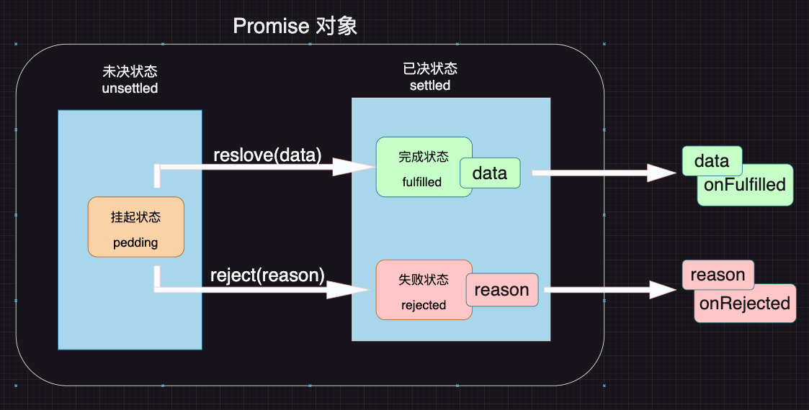
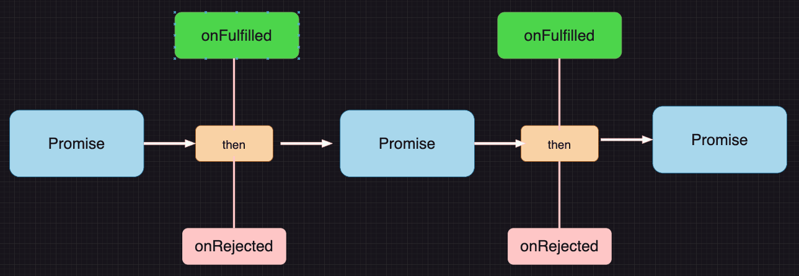

# Promise 期约

## Promise 规范
Promise 是一套专门处理异步场景的规范，他能有效的避免回调地狱的产生，使异步代码更加清晰、简洁、统一

该规范最早诞生于前端社区，规范的名称为[Promise A+](https://promisesaplus.com/)

Promise A+ 规定：

1. 所有的异步场景，都可以看作是一个异步任务、每个异步任务、在js中应该表现为一个`对象`，该对象称之为`Promise对象`，也叫做任务对象
2. 每个任务对象，都应该有两个阶段、三个状态

  

  根据常理，他们之间存在以下逻辑：
    - 任务总是从未决阶段变成已决阶段，无法逆行
    - 任务总是从挂起状态变到完成状态或失败状态，无法逆行
    - 任务一旦完成或失败，状态就固定下来了，永远无法改变
3. `挂起->完成`的过程，称之为`resolve`；`挂起->失败`的过程，称之为`reject`。任务完成时，可能有一个相关的数据，任务失败时，可能有一个失败原因。

   
4. 可以针对任务进行后续处理，针对完成状态的后续处理称之为onFulfilled，针对失败的后续处理称之为onRejected

   

## Promise API

ES6提供了一套API，实现了Promise A+规范。并且还扩展了一些方法。

使用：
```js
// 创建一个任务对象，该对象立即进入pedding状态
const p1 = new Promise((resolve, reject) => {
  // 该函数立即执行
  console.log('任务开始');
  // 调用resolve函数，将任务变为fulfilled状态，data为需要传递的相关数据
  resolve('1');
  // 任务一旦到了已决状态，后续调用resolve或者reject函数都无效了。
  resolve('12');
  reject('失败了')
  console.log('任务结束');
})

p1.then((data) => {
  console.log(data); //打印1
}).
catch((reason)=>{
  console.log(reason);
})

// 第二种写法，then方法中也可以带第二个参数，第二个参数是reject失败之后的执行函数
// p1.then((data) => {
//   console.log(data); //打印1
// },(reason)=>{
//   console.log(reason);
// })

// 打印结果
// 任务开始
// 任务结束
// 1
// 为什么先执行‘任务结束’，而后打印 1这个问题我会在后面在其他章节解释。在事件循环中解释了。
```

> `resolve`或者`reject`后面的代码还是会执行的。但是状态不会再改变了。

### catch方法
`.catch(OnRejected)` == `.then(null,onRejected)`

### 链式调用

 

1. then方法必须返回一个新的Promise（可以理解为后续处理也是一个任务）

2. 新任务的状态取决于`前面任务的`后续处理：

   - 若`前面任务`没有相关的后续处理，新任务的状态和前任务一致，数据为前任务的数据
   - 若`前面任务`有后续处理但还未执行，新任务挂起`pedding`
   - 若`前面任务`后续处理执行了（**这里的执行可以是成功的后续处理，也可以是失败的后续处理**），则根据后续处理的情况确定新任务的状态
     - 后续处理执行`无错`，新任务的状态为`完成`，数据为后续处理的返回值
     - 后续处理执行`有错`，新任务的状态为`失败`，数据为异常状态
     - 后续执行返回的是一个任务对象（new Promise了），新任务的状态和数据与该任务对象一致

##### 第一种情况：
> 没有后续处理的意思是，resolve后续没有then方法处理（或者有then方法，但第一个参数为null），reject后续没有catch处理(或者有then方法，但第二个参数为null);
```js
 let p = new Promise((resolve, reject) => {
    resolve('成功1');
  })
  let p1 = p.catch(res => {
  
  })
  setTimeout(() => {
    console.log(p);
    console.log(p1);
  }, 100);

  // 打印结果
  // Promise {<fulfilled>: '成功1'}
  // Promise {<fulfilled>: '成功1'}
```
两次的打印结果相同，应为p任务没有调用then方法，所以p1任务的状态和p相同

> 这种情况常见的例子就是链式调用`.then().catch().finally()`

##### 第二种情况：
```js
let p = new Promise((resolve, reject) => {
  setTimeout(() => {
    resolve('成功1');
  }, 1000);
})
let p1 = p.then(res => {
})
setTimeout(() => {
  console.log(p);
  console.log(p1);
}, 100);

  // 打印结果
  // Promise {<pending>}
  // Promise {<pending>}
```
1s前p任务处于pedding状态，此时p1任务也处于pedding状态。

##### 第三种情况：
这种成功的情况就不记录了。

##### 第四种情况：
```js
let p = new Promise((resolve, reject) => {
  setTimeout(() => {
    resolve('成功1');
  }, 100);
})
let p1 = p.then(res => {
  throw new Error('失败');
})
p1.catch(() => { })
setTimeout(() => {
  console.log(p);
  console.log(p1);
}, 1000);
// 打印结果
// Promise {<fulfilled>: '成功1'}
// Promise {<rejected>: Error: 失败}
```
因为p任务的的后续处理抛出错误，那么新任务的状态就是失败，所以p1的状态就是失败。


##### 第五种情况：
```js
let p = new Promise((resolve, reject) => {
  setTimeout(() => {
    resolve('成功1');
  }, 100);
})
let p1 = p.then(res => {
  return new Promise((resolve, reject) => {
    setTimeout(() => {
      // resolve('成功2');
      reject('失败2');
    }, 200);
  })
})
p1.catch(() => { })
setTimeout(() => {
  console.log(p);
  console.log(p1);
}, 1000);
// 打印结果
// Promise {<fulfilled>: '成功1'}
// Promise {<rejected>: '失败2'}
```
p任务的后续处理返回是一个promise对象，处理结果为失败，那么p1的状态也是失败

> 不管是那种情况，p1的类型都是promise对象，即链式调用的`.then`,`.catch`,`.finally`返回的类型都是promise对象。

### Promise的静态方法

| 方法名 | 含义 |
| :----:  | :----: |
| Promise.resolve(data) | 直接返回一个完成状态的任务 |
| Promise.reject(reason) | 直接返回一个拒绝状态的任务 |
| Promise.all(任务数组) | 返回一个任务，任务数组全部成功则成功(返回的数据是一个数组，数组对应的数据和任务列表的数据下标相同)，任何一个失败则失败,返回`（第一个）`失败的结果 |
| Promise.any(任务数组) | 返回一个任务，任务数组`任一成功则成功`，任务`全部失败则失败`  |
| Promise.allSettled(任务数组) | 返回一个任务，任务数组`全部已决则成功`，该任务`不会失败` |
| Promise.race(任务数组) | 返回一个任务，任务数组中`最先返回`已决则已决，状态和其一致 |

> 实际开发中，自己只用到了Promise.all。

#### Promise.resolve(data);Promise.reject(reason)
```js
const p1 = Promise.resolve(1);
const p2 = Promise.reject(1);
console.log(p1);//Promise {<fulfilled>: 1}
console.log(p2);//Promise {<rejected>: 1}
// 不会存在pedding状态，即都是已决状态
```

#### Promise.all(任务数组)
1. 都是成功的情况，返回成功的数组

  ```js
  const p1 = new Promise((resolve, reject) => {
    setTimeout(() => {
      resolve(1);
    }, 100);
  })
  const p2 = new Promise((resolve, reject) => {
    setTimeout(() => {
      resolve(2);
    }, 10);
  })
  const p3 = new Promise((resolve, reject) => {
    resolve(3);
  })

  const p4 = Promise.all([p1, p2, p3]);
  setTimeout(() => {
    console.log(p4);// Promise {<fulfilled>: Array(3)}
  }, 200);

  p4.then((data) => {
    console.log(data);// [1, 2, 3]
  }).catch((reason) => {
    console.log(reason);
  })
  ```
  !> 注意全部成功返回数组[1, 2, 3]，下标对应任务下标

2. 有失败的情况（可以多个任务失败，返回最早的那个失败结果）

  ```js
  const p1 = new Promise((resolve, reject) => {
    setTimeout(() => {
      resolve(1);
    }, 100);

  })
  const p2 = new Promise((resolve, reject) => {
    setTimeout(() => {
      reject(2);
    }, 10);
  })
  const p3 = new Promise((resolve, reject) => {
    reject(3);
  })

  const p4 = Promise.all([p1, p2, p3]);
  setTimeout(() => {
    console.log(p4);// Promise {<rejected>: 3}
  }, 200);

  p4.then((data) => {
    console.log(data);
  }).catch((reason) => {
    console.log(reason); // 3  有任务失败后直接返回失败的结果
  })
  ```

  !> 任何一个任务失败就失败，返回失败的结果，并且失败的结果为最先返回的那个任务的失败结果

#### Promise.any(任务数组)

1. 有成功的情况
  ```js
  const p1 = new Promise((resolve, reject) => {
    setTimeout(() => {
      resolve(1);
    }, 100);

  })
  const p2 = new Promise((resolve, reject) => {
    setTimeout(() => {
      resolve(2);
    }, 10);
  })
  const p3 = new Promise((resolve, reject) => {
    reject(3);
  })

  const p4 = Promise.any([p1, p2, p3]);
  setTimeout(() => {
    console.log(p4); // Promise {<fulfilled>: 2}
  }, 200);

  p4.then((data) => {
    console.log(data); // 2
  }).catch((reason) => {
    console.log(reason.errors);
  })
  ```

  !> 有成功就返回成功的数据，返回`最先成功`的数据

2. 全部失败的情况
  ```js
  const p1 = new Promise((resolve, reject) => {
    setTimeout(() => {
      reject(1);
    }, 100);
  })
  const p2 = new Promise((resolve, reject) => {
    setTimeout(() => {
      reject(2);
    }, 10);
  })
  const p3 = new Promise((resolve, reject) => {
    reject(3);
  })

  const p4 = Promise.any([p1, p2, p3]);
  setTimeout(() => {
    console.log(p4);// Promise {<rejected>: AggregateError: All promises were rejected}
  }, 200);

  p4.then((data) => {
    console.log(data);
  }).catch((reason) => {
    console.log(reason.errors);// [1, 2, 3]
  })
  ```
  
  !> 全部失败，返回失败的数据，对应数组对应返回的数据的下标对应任务数组的下标

#### Promise.allSettled(任务数组)

1. 有未决的任务`pedding状态`
  ```js
  const p1 = new Promise((resolve, reject) => {
    setTimeout(() => {
      reject(1);
    }, 100);

  })
  const p2 = new Promise((resolve, reject) => {
    setTimeout(() => {
      reject(2);
    }, 10);
  })
  const p3 = new Promise((resolve, reject) => {
    // reject(3);
  }) 

  const p4 = Promise.allSettled([p1, p2, p3]);
  setTimeout(() => {
    console.log(p4); // Promise {<pending>}
  }, 200);

  p4.then((data) => {
    console.log(data);
  }).catch((reason) => {
    console.log(reason.errors);
  })
  ```

  !> 只要有一个任务处于未决状态，返回任务一直处在未决状态

2. 全部任务都是已决
  ```js
  const p1 = new Promise((resolve, reject) => {
  setTimeout(() => {
    reject(1);
  }, 100);

  })
  const p2 = new Promise((resolve, reject) => {
    setTimeout(() => {
      reject(2);
    }, 10);
  })
  const p3 = new Promise((resolve, reject) => {
    resolve(3);
  })

  const p4 = Promise.allSettled([p1, p2, p3]);
  setTimeout(() => {
    console.log(p4); // Promise {<fulfilled>: Array(3)}
  }, 200);

  p4.then((data) => {
    console.log(data);
    //0: {status: 'rejected', reason: 1}
    //1: {status: 'rejected', reason: 2}
    //2: {status: 'fulfilled', value: 3}
  }).catch((reason) => {
    console.log(reason.errors);
  })
  ```

  !> 即使有任务失败，p4的任务状态还是`fulfilled`成功的。

#### Promise.race(任务数组)
返回一个新的Promise，第一个完成的Promise的结果状态就是最终的结果状态
```js
const p1 = new Promise((resolve, reject) => {
  setTimeout(() => {
    reject(1);
  }, 100);
})
const p2 = new Promise((resolve, reject) => {
  setTimeout(() => {
    reject(2);
  }, 10);
})
const p3 = new Promise((resolve, reject) => {
  reject(3);
})

const p4 = Promise.race([p1, p2, p3]);
setTimeout(() => {
  console.log(p4);// Promise {<rejected>: 3}
}, 200);

p4.then((data) => {
  console.log(data);
}).catch((reason) => {
  console.log(reason); // 3
})
```

!> p3任务最先完成，是失败的状态，那么p4的状态也是失败的状态

#### Promise.finally()
该方法用于给期约添加onFinally处理程序，这个处理程序在期约转换为成功或拒绝状态使都会执行。这个方法可以避免onResolved和onRejected处理程序中出现冗余代码。但onFinally处理程序没有办法知道期约的状态是成功的还是拒绝，所以这个方法主要用于添加清理代码，如：`移除loading`，`按钮的disabled状态`等等

## 消除回调
### async await 关键字

> 这仅仅是一个语法糖，主要学习还是在上面的知识点

```js
function fn () {
  return new Promise((resolve, reject) => {
    setTimeout(() => {
      // resolve('成功');
      reject('失败');
    }, 1000);
  })
}
(async () => {
  // 需要捕获一下错误的情况
  try {
    const data = await fn();// 成功的数据在这里获取
    console.log(data);
  } catch (error) {
    console.log(error); // 如果fn函数返回错误状态的promise，在这里获取
  }
})()
```

!> 记得需要trycatch捕获一下错误，更加严谨

## 简单实现Promise

```js
const PADDING = 'padding'/* 等待状态 */;
const FULFILLED = 'fulfilled'/* 完成状态 */;
const REJECTED = 'rejected'/* 失败状态 */;
class MyPromise {
  #status = PADDING;
  #result;
  #handlers = [];
  constructor(executor) {
    /* 待处理函数，收集then 的回调函数 */
    /* 为什么不把reslove和reject放到原型上呢？
    因为reslove和reject会涉及到this和状态。外面调用resolve和reject的时候，
    this指向的应该是MyPromise1实例，而不是window（或者undefined）。 所以就不能放到原型上*/
    const resolve = (data) => {
      this.#changeStatus(FULFILLED, data);
    }
    const reject = (reason) => {
      this.#changeStatus(REJECTED, reason);
    }
    try {
      executor(resolve, reject);
    } catch (error) {
      this.#changeStatus(REJECTED, error);
    }
  }
  /* 修改状态 */
  #changeStatus (status, result) {
    /* 状态只能由未决变成已决 */
    if (this.#status !== PADDING) return;
    this.#status = status;
    this.#result = result;
    this.#run();
  }
  /**
   * then方法
   * @param {*} onFulfilled 成功回调
   * @param {*} onRejected 失败回调
   * @returns 
   */
  then (onFulfilled, onRejected) {
    return new MyPromise((resolve, reject) => {
      /* 收集回调函数
        包含上一个任务的成功回调和失败回调，和当前任务的
      */
      this.#handlers.push({
        onFulfilled,
        onRejected,
        resolve,
        reject
      })
      /* 需要立即执行一次run方法,因为执行器（executor）可能存在直接调用resolve或者reject的情况 */
      this.#run();
    });
  }

  catch (onRejected) {
    return this.then(null, onRejected);
  }

  /* 判断是否为promise */
  #isPromiseLike (value) {
    return value !== null && typeof value === 'object' && typeof value.then === 'function';
  }

  /* 把then方法中的回调函数放到微任务队列中执行 */
  #runMicroTask (callback) {
    /* 这里有一个问题： setTimeout中的回调函数在延时队列中执行，而不是在微队列中执行
    在事件循环那篇文章中说，回调函数添加到微队列中有两种方式一种是Promise.resolve().then()，
    另一种就是MutationObserver，我们可以通过MutationObserver来模拟微队列
    */
    setTimeout(() => {
      callback();
    }, 0);
  }

  #runOne (callback, resolve, reject) {
    this.#runMicroTask(() => {
      /* 1.判断callback是否为函数 */
      if (typeof callback === 'function') {
        try {
          const data = callback(this.#result);
          /* 判断data是否为promise */
          console.log(data);
          if (this.#isPromiseLike(data)) {
            /* 返回的是一个任务对象，那么新任务的状态和数据与该任务对象一致 */
            /* 到底执行的是resolve还是reject，
            取决于回调函数的返回值的后续处理，
            如果成功就执行resolve，失败就执行reject */
            /* 你成功我就调用resolve，你失败我就调用reject，并且传递的数据和你一样 */
            // data.then((data) => {
            //   resolve(data);
            // }, (reason) => {
            //   reject(reason);
            // })
            /* 简写成 */
            data.then(resolve, reject);
          } else {
            /* 如果data不是promise，则直接调用resolve */
            resolve(data);
          }
        } catch (error) {
          /* 前一个任务后续处理有错，新任务的状态为失败，数据为异常数据 */
          reject(error);
        }
      } else {
        /* callback不是函数的情况 */
        /* 新任务的状态和前任务相同，数据为前任务的数据 */
        const settled = this.#status == FULFILLED ? resolve : reject;
        settled(this.#result);
      }
    })
  }

  #run () {
    /* 后续任务还未执行，新任务挂起(默认就是挂起的状态) */
    if (this.#status == PADDING) return;
    while (this.#handlers.length) {
      /* 先进先出 */
      const {
        onFulfilled,
        onRejected,
        resolve,
        reject
      } = this.#handlers.shift();
      // console.log(this.#status);
      /* 新任务的状态取决于前面任务的后续处理 */
      if (this.#status === FULFILLED) {
        this.#runOne(onFulfilled, resolve, reject);
      } else if (this.#status === REJECTED) {
        this.#runOne(onRejected, resolve, reject);
      }
    }
  }
}
``` 