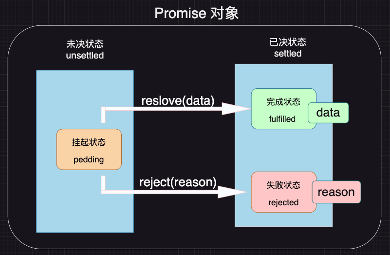
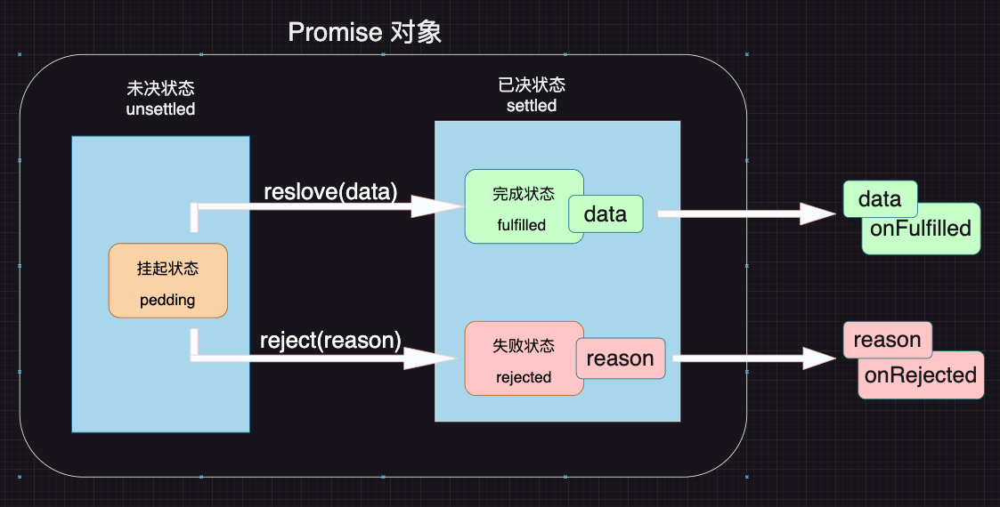
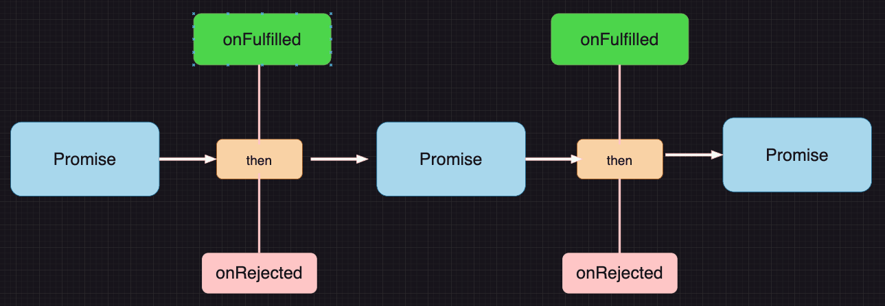

# Promise 期约

## Promise 规范
Promise 是一套专门处理异步场景的规范，他能有效的避免回调地狱的产生，使异步代码更加清晰、简洁、统一

该规范最早诞生于前端社区，规范的名称为[Promise A+](https://promisesaplus.com/)

Promise A+ 规定：

1. 所有的异步场景，都可以看作是一个异步任务、每个异步任务、在js中应该表现为一个`对象`，该对象称之为`Promise对象`，也叫做任务对象
2. 每个任务对象，都应该有两个阶段、三个状态

  

  根据常理，他们之间存在一下逻辑：
    - 任务总是从未决阶段变成已决阶段，无法逆行
    - 任务总是从挂起状态变到完成完成或失败状态，无法逆行
    - 时间不能倒流，历史不能改写，任务一旦完成或失败，状态就固定下来了，永远无法改变
3. `挂起->完成`的过程，称之为`resolve`；`挂起->失败`的过程，称之为`reject`。任务完成时，可能有一个相关的数据，任务失败时，可能有一个失败原因。

   
4. 可以针对任务进行后续处理，针对完成状态的后续处理称之为onFulfilled，针对失败的后续处理称之为onRejected

   

## Promise API

ES6提供了一套API，实现了Promise A+规范

使用：
```js
// 创建一个任务对象，该对象立即进入pedding状态
const p1 = new Promise((resolve, reject) => {
  // 该函数立即执行
  console.log('任务开始');
  // 调用resolve函数，将任务变为fulfilled状态，data为需要传递的相关数据
  resolve('1');
  // 任务一旦到了已决状态，后续调用resolve或者reject函数都无效了。
  resolve('12');
  // reject('失败了')
  console.log('任务结束');
})

p1.then((data) => {
  console.log(data); //打印1
}).
catch((reason)=>{
  console.log(reason);
})

// 第二种写法，then方法中也可以带第二个参数，第二个参数是reject失败之后的执行函数
// p1.then((data) => {
//   console.log(data); //打印1
// },(reason)=>{
//   console.log(reason);
// })

// 打印结果
// 任务开始
// 任务结束
// 1
// TODO：为什么先执行‘任务结束’，而后打印 1这个问题我会在后面在其他章节解释
```

### catch方法
`.catch(OnRejected)` == `.then(null,onRejected)`

### 链式调用

 

1. then方法必须返回一个新的Promise（可以理解为后续处理也是一个任务）

2. 新任务的状态取决于`前面任务的`后续处理：

   - 若`前面任务`没有相关的后续处理，新任务的状态和前任务一致，数据为前任务的数据
   - 若`前面任务`有后续处理但还未执行，新任务挂起`pedding`
   - 若`前面任务`后续处理执行了，则根据后续处理的情况确定新任务的状态
     - 后续处理执行`无错`，新任务的状态为`完成`，数据为后续处理的返回值
     - 后续处理执行`有错`，新任务的状态为`失败`，数据为异常状态
     - 后续执行返回的是一个任务对象（new Promise了），新任务的状态和数据与该任务对象一致
