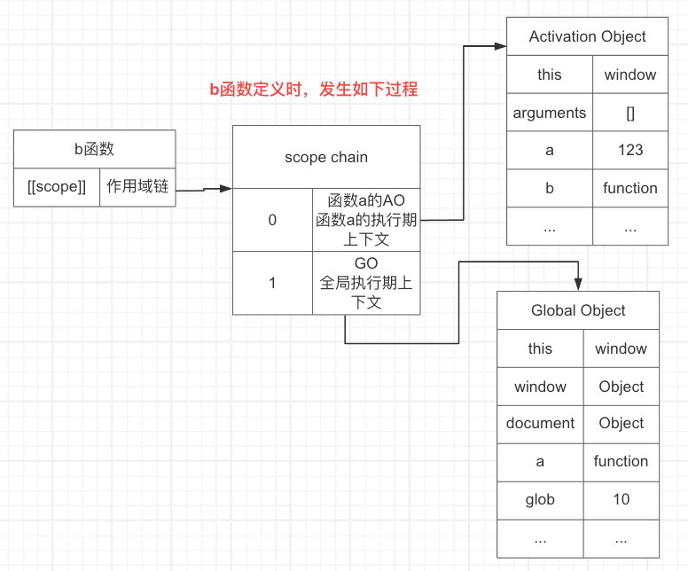

## 作用域

每个javascript函数都是一个对象，对象中有些属性可以访问如`name`，但有些不可以，这些不可以的属性仅供javascript引擎存取,[[scope]]就是其中一个
`[[scope]]`：指的是我们所说的`作用域`，其中存储了运行期上下文的集合

## 作用域链
[[scope]]中所存储的执行期上下文对象的集合，这个集合呈链式链接，我们把这种链式链接叫做`作用域链`

### 举例分析
```js
  function a () {
    var a = 123;
    console.log(a);
    function b (){}
  }
  var glob = 10;
  console.dir(a);//dir打印可以看到[[scope]] 存储着GO对象，AO是看不到的，函数执行完成后AO就被销毁了
  a();
```
#### a函数的定义
当全局js在执行的前一刻，会进行全局的预编译，产生一个全局的GO对象，并且系统会给所有全局定义的函数内部创建一个[[scope]]属性，[[scope]]中保存该函数的作用域链，即保存了GO对象。


#### a函数的执行
a函数执行的前一刻，会产生函数a的AO对象，把AO对象放在作用域链的顶端


!> 全局的GO 和 函数a执行时作用域链中的GO相同吗？`相同`，因为作用域链中的执行期上下文GO存储的是GO的引用

!> 如果函数a执行两次，执行两次对应的AO相同吗？ `不相同`，因为函数执行完，会把对应的AO删除，每次产生的AO都是新的AO

### 进阶
在a函数中再执行b函数，分析b函数定义与执行期的作用域
```js
  function a () {
    var a = 1;
    console.log(a);
    function b () {
      var c = 10;
      console.log(c);
      console.log(a);
    }
    b();
  }
  var glob = 100;
  console.dir(a);
  a();
```

#### b函数的定义

在a函数执行时，会产生b函数的定义，b函数内部会创建[[scope]]属性，保存作用域链，此时b的上下文环境是a函数执行的时候的上下文环境，即a的AO对象。即`b函数的定义时的作用域链`就是`a函数执行时的作用域链`。



#### b函数的执行

由于a的执行产生b的定义，b函数中的scope保存了a函数的AO对象和全局的GO对象。此时在加上b执行时产生的b的AO对象，那么b的AO对象就保存到作用域链的最顶端。


## 查找变量

从作用域的顶端依次向下查找。

比如上面的例子b函数中打印a，但是b函数的AO中没有a变量，那么就向下寻找，到a的AO中寻找，找到了打印 1。