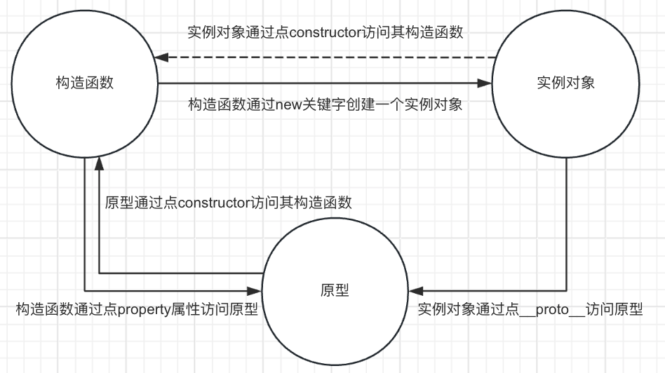
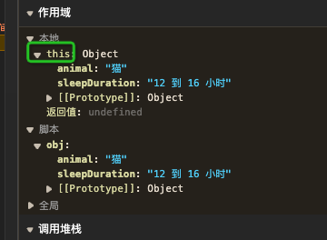
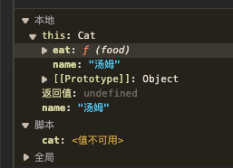
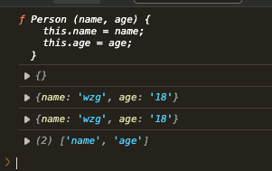

## 原型

### 定义
原型是function函数的一个属性，这个属性是一个对象。它定义了构造函数制造出来的实例的公共祖先。通过该构造函数产生的实例对象，可以继承来着原型的属性和方法，原来在构造函数中直接赋给对象实例的值，可以直接赋值给它们的原型。

 - 利用原型特点，可以提取共有属性
 - 实例对象如何查看原型 隐式属性`__proto__`
 - 实例对象如何查看对象的构造函数`constructor`
 - function函数如何查看原型`prototype`

此图为构造`函数` `实例对象` `原型`之间的关系图



!> 注意，不要被`实例对象点constructor`获取构造函数所影响，就说constructor是实例对象的属性，记住`constructor属性是在原型上的`，它是通过原型链的方式，在原型上找到constructor属性，而不是实例对象上。

### 实例对象对原型进行增删改吗？
答：都不可行，只有访问才行。做增删改相当于在实例对象上做增删改。

## 原型链
当谈到继承时，JavaScript只有一种结构：对象。每个对象都有一个私有属性（[[Prototype]]）指向另一个名为原型（prototype）的对象。原型对象也有自己的原型，层层向上直到一个对象的原型为null。根据定义，`null没有原型`，并作为这个`原型链`（property chain）中的最后一个环节。

### 原型的作用（继承）
在我们实例化对象的时候，总有一些写死的值（不一定是常量）和方法，这些写死的值和方法，我都需要再创建实例对象的时候再初始化一边。其实这些代码，对于实例化对象来说是代码的冗余

一般情况下，`方法都是写在原型上`，`属性有些写在原型上`，有些写在构造函数中（需要传参的属性写在构造函数中，但也不一定）。原因，减少代码的冗余

当实例对象上没有对应的属性或者方法的时候，`会向其原型链上找`。

一个对象可以访问其原型链上的任意属性的形式方法叫做`原型链继承`。

```js
  function Person (name) {
    this.name = name;
    // this.getName = function () {
    //   return this.name
    // }
  }
  Person.prototype.getName = function () {
    return this.name
  }

  let p1 = new Person('wzg');
  console.log(p1.name); // wzg
  console.log(p1.getName()); // wzg
```


## call,apply,bind的作用

### call
Function 实例的 call() 方法会以给定的 this 值和逐个提供的参数调用该函数。
1. 可以调用函数
2. 改变函数中 this 的指向。
2. 继承

作用1：
```js
   function fn1 () {
    console.log('打印');
  }
  fn1();
  fn1.call();
```
两者执行函数没有区别


作用2：

- 调用call没有第二个参数
```js
 function greet () {
    console.log(this.animal, "的睡眠时间一般在", this.sleepDuration, "之间");
  }
  const obj = {
    animal: "猫",
    sleepDuration: "12 到 16 小时",
  };
  /* greet函数中的this,指向obj对象 */
  greet.call(obj); // 猫 的睡眠时间一般在 12 到 16 小时 之间
```


改变`greet`函数中的this指向，换句话说是`greet`函数中的this指的就是`obj`对象。我们通过debugger调试代码，发现greet执行时，其中this对象和obj对象相同。

- 有第二个参数或者更多参数
```js
  let dog = {
    name: '小狗',
    eat (food, status) {
      console.log(this.name + `吃${food}${status}`);
    }
  }
  dog.eat('肉', '很开心');//小狗吃肉很开心
  let cat = {
    name: '小猫',
  }
  dog.eat.call(cat, '鱼', '很开心');//小猫吃鱼很开心
```

apply 调用

传递参数的区别，apply通过数组的方式
```js
dog.eat.apply(cat, ['鱼', '很开心']);
```

bind 调用

传递参数没区别，只是函数没有立即执行，返回一个函数，可在需要调用的时候调用。
```js
let fn = dog.eat.bind(cat, '鱼', '很开心');
fn();
```

- 继承（盗用构造函数）
```js
 function Animal (name) {
    this.name = name；
    this.eat = function (food) {
      console.log(`${name}喜欢吃${food}`);
    }
  }
  function Cat (name) {
    Animal.call(this, name)
  }
  let cat = new Cat('汤姆');
  cat.eat('鱼');
```


运行到`Animal.call(this, name)`这段代码的时候，Animal构造函数里面的this，就是实例化对象cat，这样做就实现了，Cat构造函数继承了Animal中的一些属性和方法（仅仅是this点上的一些属性和方法。）


### 自己实现call函数
```js
  Function.prototype.myCall = function (ctx, ...args) {
    console.log(this);
    console.log(ctx);
    let key = Symbol('key');
    Object.defineProperty(ctx, key, {
      value: this,
      configurable: true
    })
    /* configurable 在没有设置的情况下，默认值是false */
    var result = ctx[key](...args);
    /* 删除了对应的属性，enumerable是否设置了是否可以枚举已经没有意义了 */
    delete ctx[key];
    return result;
  }

  function Person (name, age) {
    this.name = name;
    this.age = age;
  }
  // debugger
  let p1 = {};
  let p2 = {};
  Person.myCall(p1, 'wzg', '18')
  Person.call(p2, 'wzg', '18')
  console.log(p1);
  console.log(p2);
  console.log(Object.keys(p1));
```


`谁调用this就指向谁。`

因为Person.myCall()这样调用，myCall中的this就指向Person，但我们需要Person函数中的this指向ctx。那么就需要通过对象去调用this，这样Person中的this就指向ctx。

那么需要定义一个唯一的属性名使之不会覆盖原有对象中的相同属性，这里就可以用到Symbol，通过ctx\[key\](...args)，就可以把Person中的this指向ctx，最后把属性删除。

删除属性的时候需要注意设置`configurable: true`，因为默认值是false，就不能被删除。