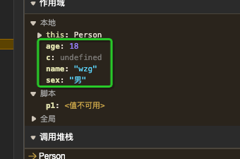
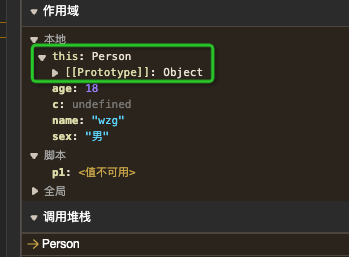
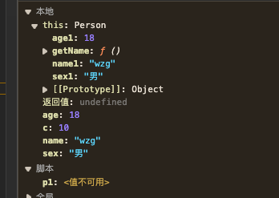
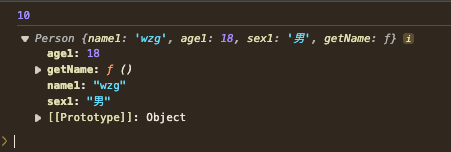
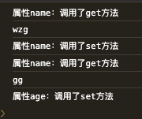

## 对象的创建

### 字面量创建对象

```js
let obj = {
  name: 'wzg',
  age: 18
}
```

### 使用`new Object()`，创建新对象。（不使用，没必要，繁琐）
### 使用`Object.create()`，创建新对象
静态方法以一个现有对象作为原型，创建一个新对象。
```js
// 语法
Object.create(proto)
```
proto：新创建对象的原型对象。
```js
  let obj = { name: 'wzg', age: 18 };
  let obj1 = Object.create(obj);
  console.log(obj1.__proto__ === obj); // true
```

### 构造函数创建对象
通过`new`关键字创建一个用户定义的对象类型的实例或者具有构造函数的内置对象的实例

当使用`new`关键字调用函数时，该函数将被作为构造函数。new将执行下面操作

1. 创建一个空的对象。即`{}`。为方便起见，我们称之为`newInstance`。
2. 如果构造函数的`property`属性是一个对象，则将newInstance的[[Property]]指向构造函数的`property`属性，否则newInstance将保持为一个普通对象，其[[Property]]为Object.property。
  - 因此，通过构造函数创建的所有实例都可以访问添加到构造函数property属性中的属性和对象。
3. 使用给定参数执行构造函数，并将newInstance绑定为`this`的上下文（换句话说，在构造函数中的所有this引用都指向newInstance）。
4. 如果构造函数返回非原始值，则该返回值成为整个new表达式的结果。否则，如果构造函数未返回任何值或者返回了一个原始值，则返回newInstance。（一般不返回，但可以选择返回值，以覆盖正常的对象创建过程）

#### 举例
```js
  debugger
  function Person (name, age, sex) {
    this.name1 = name;
    this.age1 = age;
    this.sex1 = sex;
    this.getName = function () {
      return this.name1;
    }
    var c = 10;
    console.log(10);
  }
  Person.prototype.name2 = 'gg';
  let p1 = new Person('wzg', 18, '男');
  console.log(p1);
```
通过new 关键字来执行函数，会有函数预编译的过程吗？`有的`

直接打开`debugger`调试，执行到`let p1 = new Person('wzg', 18, '男')`，就可以看到如下的Person函数执行时的AO。



此时我们会发现，执行Person函数的AO中有`this`属性。展开对象发现里面是一个空对象，其中[[Property]]为Object.property。（这一现象，对应的就是构造函数创建对象的第一步和第二步和第三步）。

通过debugger，发现一个小小的问题（或者说是现象），就是newInstance绑定为`this`的上下文是在执行构造函数之前的。为啥这么说呢，因为 newInstance 没有 name1，age1，sex1这三个属性，只有代码执行到相关行的时候才有赋值，不过代码是瞬间完成的，也不扣这些字眼了。



构造函数执行到最后一行时：



打印p1，发现返回的值就是newInstance，也就是执行构造函数时是this



!> 对于执行构造函数时的第二步和第四步的其他情况，我就不贴出来了，自己试着改改

#### 构造函数的问题
构造函数中定义的方法会在每个实例上都创建一遍。如上面的getName方法，每个实例化对象中都有，方法的作用都相同，没必要每次实例化都创建。所以需要通过`原型模式`来解决这个问题

## 函数二义性的产生和消除
### 产生的原因
为了支持面向对象
#### 二义性现象
 - 你可以把函数当成一个流程，调用它，把里面的函数代码执行一遍
 - 你也可以把它当成一个构造函数，用来创建一个对象，把这个函数的含义变成了创建一个对象的过程

### 消除二义性

ES6之前，只能通过`命名规范约束`，函数`首字母大写`来表示构造函数。（无法做到强约束，如抛出错误）

ES6 通过`class 关键字` 创建对象，不能当做函数调用来执行。

ES6 通过`new.target`语法来 检测函数或构造方法是否是通过new运算符被调用的。
```js
  function Person () {
    if (!new.target) throw new Error(`这是个构造函数，请使用new关键字创建对象`)
    this.name = 'wzg';
  }

  Person();
  // 打印错误 Uncaught Error: 这是个构造函数，请使用new关键字创建对象
```
```js
  class Person {
    constructor(name) {
      this.name = name;
    }
  }
  Person();
  // TypeError: Class constructor Person cannot be invoked without 'new'
```
```js
  function person () {
    if (new.target) throw new Error(`这是个普通函数，请不要使用new关键字`)
    let name = 'wzg';
    console.log(name);
  }
  new person();
  // Uncaught Error: 这是个普通函数，请不要使用new关键字
```

## 属性的类型（属性描述符）

`Object.defineProperty`静态方法会直接在一个对象上定义一个新属性，或者修改现有属性，并返回此对象。


### 数据属性（数据描述符）

有4个特性描述它的行为。

1. configurable：
  - 设置为false时：
    - 不可以通过delete删除，
    - 不可改为访问器属性
    - 描述符的其他属性不可被更改
2. enumerable：设置为true时，表示可以通过`for-in`循环获取到返回值。`默认值：false`
3. writable： 设置为true时，表示属性的值是可以被修改。`默认值：false`
4. value：属性的实际值。`默认值：undefined`

!> 上面所说的`默认值`都是通过`Object.defineProperty`去描述一个对象的属性，且第三个参数为一个空对象时默认值为false。如果通过字面量的方式定义对象的属性，对应的值都是true。

#### 举例：全是true的情况

这样定义对象的属性，两个属性没有任何区别
```js
let obj = {
  age: 18
};

Object.defineProperty(obj, 'name', {
  value: 'wzg',
  enumerable: true,
  writable: true,
  configurable: true
})
console.log(obj);
```

#### 举例：enumerable为false
通过`for-in`循环打印只能获取到age属性，获取不到name属性
```js
let obj = {
  age: 18
};
Object.defineProperty(obj, 'name', {
  value: 'wzg',
  enumerable: false,
  writable: true,
  configurable: true
})
for (const key in obj) {
  console.log(key);// age
}
console.log(obj);// {age: 18, name: 'wzg'}
```
#### 举例：writable为false
name不可被修改，还是为'wzg'
```js
let obj = {
  age: 18
};
Object.defineProperty(obj, 'name', {
  value: 'wzg',
  enumerable: true,
  writable: false,
  configurable: true
})
for (const key in obj) {
  console.log(key);// age  name
}
obj.name = 'gg';
console.log(obj); // {age: 18, name: 'wzg'}
```
#### 举例：configurable为false

如果再次通过`Object.defineProperty`修改name属性报错， TypeError: Cannot redefine property: name

不能重新定义属性：name
```js
let obj = {
  age: 18
};
Object.defineProperty(obj, 'name', {
  value: 'wzg',
  enumerable: true,
  writable: true,
  configurable: false
})
for (const key in obj) {
  console.log(key); // age  name
}
obj.name = 'gg';
console.log(obj); // {age: 18, name: 'gg'}

// 报错， TypeError: Cannot redefine property: name
// 不能重新定义属性：name
Object.defineProperty(obj, 'name', {
  value: 'wzg',
  enumerable: false,
  writable: false,
  configurable: false
})
```
#### 举例：组合的情况，就不举例了
### 访问器属性（访问器描述符）

!> 访问器属性不包含`value`值。多了`get和set函数`

1. configurable：和之前相同
2. enumerable：和之前相同
3. get函数：当读取属性时会调用。默认值`undefined`
4. set函数：当修改属性时会调用。默认值`undefined`

#### 举例1

对属性name的获取与赋值会触发对应的get和set方法。
```js
  let obj = {
    __name__: 'wzg',
    age: 18
  }

  Object.defineProperty(obj, 'name', {
    get () {
      console.log('调用了get方法');
      return this.__name__;
    },
    set (newValue) {
      console.log('调用了set方法');
      this.__name__ = newValue;
    }
  })
  console.log(obj.name);// 获取name属性值，会触发get函数
  obj.name = 'gg';// 修改name属性值，会触发set函数
```
但是我们会发现我们定义了一个不想外接访问的变量`__name__`，这个变量仅仅是为了保存`name`的值，如果`obj`对象有很多属性，且都需要定义访问器属性，那么会存在类似`__name__`这样的的很多无效的变量。那么需要怎么做呢？

#### 举例2，解决上述问题
```js
  let obj = {
    name: 'wzg',
    age: 18
  }
  Object.keys(obj).forEach((key) => {
    defineReactive(obj, key, obj[key]);
  })
  /* 定义了一个响应式函数 */
  function defineReactive (obj, key, val) {
    Object.defineProperty(obj, key, {
      get () {
        console.log(`属性${key}：调用了get方法`);
        return val;
      },
      set (newValue) {
        console.log(`属性${key}：调用了set方法`);
        val = newValue;
      }
    })
  }
  console.log(obj.name);
  obj.name = 'gg';
  console.log(obj.name);
  obj.age = 20;
```


此时定义了一个`defineReactive`函数，`Object.defineProperty`中定义的`get`和`set`访问器函数，访问并修改了外部作用域`val`的值，形成了闭包。通过`val`属性完美的解决了上面,多定义类型`__name__`这样属性的问题，是的obj中的所有属性都会触发`get`和`set函数`。

> 例2中的代码，和vue2中`defineReactive`函数的定义的核心功能差不多，有兴趣的同学可自行比对查看。
