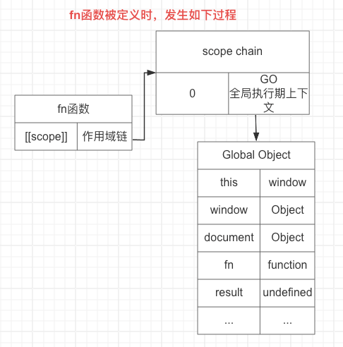
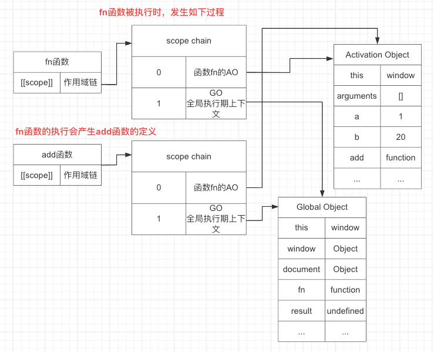
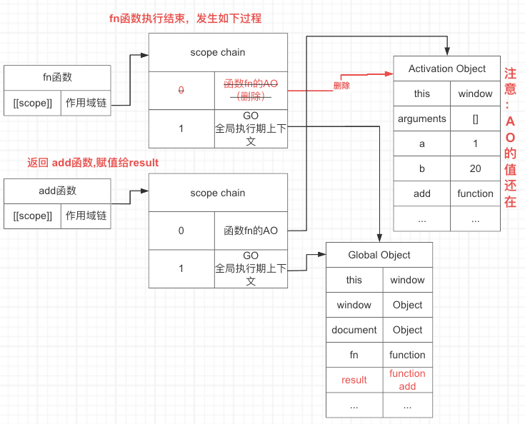
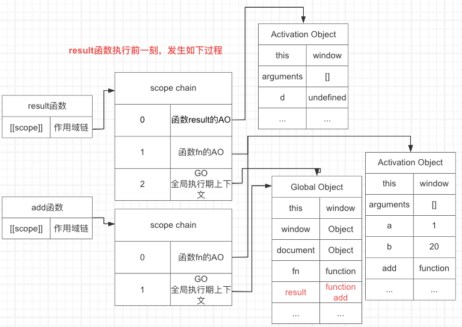
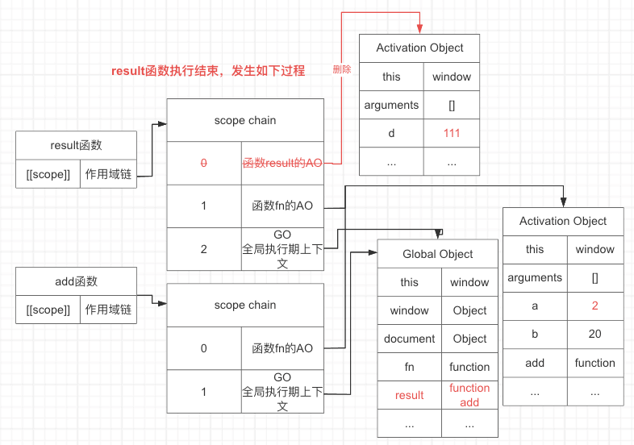
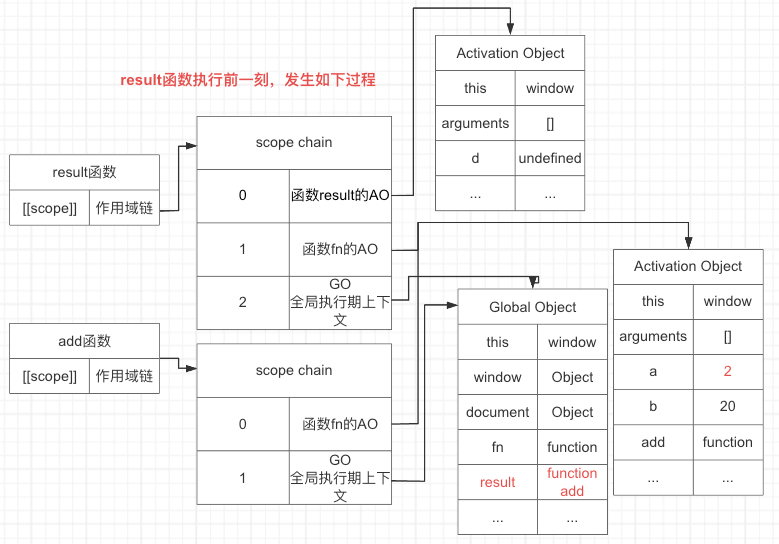
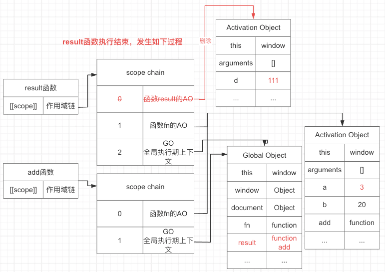

## 闭包

### 定义
在《JavaScript高级程序设计（第四版）》中是这么定义闭包的：闭包指的是那些引用了另一个函数作用域中的变量的函数，通常是在嵌套函数中实现的。

在《你不知道的JavaScript（上卷）》中是这么定义闭包的：当函数可以记住并访问做在的词法作用域时，就产生了闭包，即使函数是在当前词法作用域之外执行。

在mdn官网中是这么定义[闭包](https://developer.mozilla.org/zh-CN/docs/Web/JavaScript/Closures)。的：闭包（closure）是一个函数以及其捆绑的周围环境状态（lexical environment，词法环境）的引用的组合。换而言之，闭包让开发者可以从内部函数访问外部函数的作用域。


### 举例
```js
  function fn () {
    var a = 1;
    var b = 20;
    function add () {
      a++;
      var d = 111;
      console.log(add);
      console.log(a);
      console.log(d);
    }
    return add;
  }
  debugger
  var result = fn();
  result();
  result();
  console.dir(result);
```

#### fn函数的定义
当全局js在执行的前一刻，会进行全局的预编译，产生一个全局的GO对象，并且系统会给所有全局定义的函数内部创建一个[[scope]]属性，[[scope]]中保存该函数的作用域链，即保存了GO对象。




#### fn函数的执行，与add函数的定义
fn函数执行的前一刻，会产生函数fn的AO对象，把AO对象放在作用域链的顶端

此时fn函数的执行，会产生add函数的定义，此时系统会给add函数创建一个[[scope]]属性，[[scope]]中保存该函数的作用域链，即fn函数执行的时候fn函数的作用域链



#### fn函数的执行完成，返回add函数，并赋值给result变量
fn函数执行完成后，销毁对应的AO，此时要注意的时候删除的是AO的引用，即地址，不会删除引用对应的值。（是否删除对应的堆内存的值，由垃圾回收机制决定，我们在这里不考虑）

此时result变量接收add函数 那么全局中变量result的值就变成了add函数，这时候要注意的是result函数的作用域链里面存的是什么，存的是执行期fn函数的作用域链即fn的AO，全局的GO



### result此时是函数了，执行

result变成函数后，执行的前一刻，会产生一个新的AO（执行多次产生新的AO），即add函数的AO。此时执行a变量自增，a变量在add函数中AO对象中没有，程序会沿着作用域链向下寻找，找到fn的AO对象，找到了`a赋值为2`。

result执行结束，会删除result函数的AO，由于AO的值没有被其他变量引用，那么其值也会被删除。





再次执行result函数后 的前一刻，会产生一个新的AO（执行多次产生新的AO），即add函数的AO，此时执行a变量自增，a变量在add函数中AO对象中没有，程序会沿着作用域链向下寻找，到fn的AO对象，找到了`a赋值为3`。

result执行结束，会删除result函数的AO，由于AO的值没有被其他变量引用，那么其值也会被删除。

打印result，发现其作用域中的a变量为3。





> 引用《你不知道的JavaScript（上卷）》中的一段话作为总结：add()依然持有对该作用域的引用，而这个引用就叫作`闭包`

我越来越感觉，fn的AO就是那个闭包