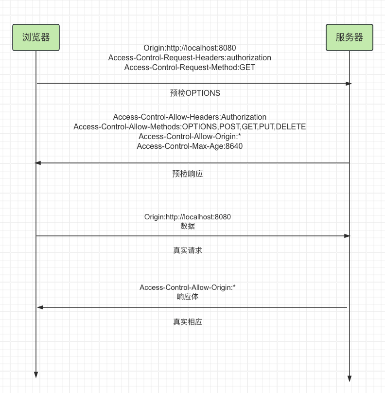

## http简介

1. 每次请求-相应 都是独立的，相互之间不会干扰，这种模式的协议我们称之为`无状态协议`
2. 每次请求-相应传递的消息都是纯文本（字符串）

## 同源策略
源 = 协议 + 主机 + 端口，两个源相同，称之为`同源`，两个源不同，称之为`跨源或跨域`

若`页面的源`和页面运行过程中`加载的源`不一致时，出于安全考虑，浏览器会对跨域的资源访问进行一些限制(尤其是ajax请求限制的最明显。css,js,img等资源的现在很宽，所以这些资源我们大部分情况下都可以访问到)

!> 记住跨域问题只有在浏览器中才有。如app就不会有跨域问题

跨越解决方案：
1. 代理
2. CORS（基本上就用这种方案）
3. ~~JSONP~~

## 跨越资源共享（CORS）
`CORS`是基于 `http1.1`的一种跨域解决方案，全称Cross-Origin Resource Sharing，跨越资源共享。

总体思路：如果浏览器要跨域访问服务器的资源，需要获得服务器的允许

CORS规定了三种不同的交互模式
1. 简单请求
2. 需要预检的请求
3. 附带身份凭证的请求

### 简单请求的判定
当同时满足下面三个条件，浏览器会认为它是一个简单请求
1. 请求方法属于下面的一种：
  - GET
  - POST
  - HEAD
2. 请求头仅包含安全字段（也可以这么理解，自己加了新的请求头就不是简单请求）
  - Accept
  - Accept-Language
  - Content-Language
  - Content-Type(需要注意额外的限制)
  - Range
  - 等等
3. Content-Type的值仅限于下列三者之一：
  - text/plain
  - multipart/form-data
  - application/x-www-form-urlencoded

### 简单请求的交互规范
当浏览器判定某个ajax跨域请求是简单请求时，会发生以下的事情
1. 请求头中会自动添加`Origin`字段
2. 服务器响应头中应包含`Access-Control-Allow-Origin`字段
  - 该字段可以是：
    - * ：表示什么人都可以访问
    - 具体的源：`https://www.baidu.com`,表示只运行百度跨域

### 预检请求
简单请求对服务器的威胁不大，所以允许使用上述的简单简单交互就可以访问到资源

但是，如果不是简单请求，那么需要下面的进行下面的流程
1. 浏览器发送预检请求，询问服务器是否允许
  预检请求没有请求体，它包含了后续真实请求要做的事情，并且它有以下特征
  - 请求方法为`OPTIONS`
  - 没有请求体
  - 请求头包含
    - `Origin`：请求的源，和简单请求的含义一致
    - `Access-Control-Request-Method`：后续的真实请求将使用的请求方法
    - `Access-Control-Request-Headers`：后续的真实请求会改动的请求头（**不区分大小写**。测试结果：都换转成小写）
2. 服务器允许
  对于预检请求，不需要响应任何的消息体，只需要在响应头中添加：
  - `Access-Control-Allow-Origin`：和简单请求一样，表示允许的源
  - `Access-Control-Allow-Methods`：表示允许的后续真实的请求方法
  - `Access-Control-Allow-Headers`：表示允许改动的请求头
  - `Access-Control-Max-Age`：告诉浏览器，多少秒没，对于同样的请求源、方法、头、都不需要再发送预检请求了
3. 浏览器发送真实请求（和简单请求相同）
4. 服务器完成真实的相应（和简单请求相同）

