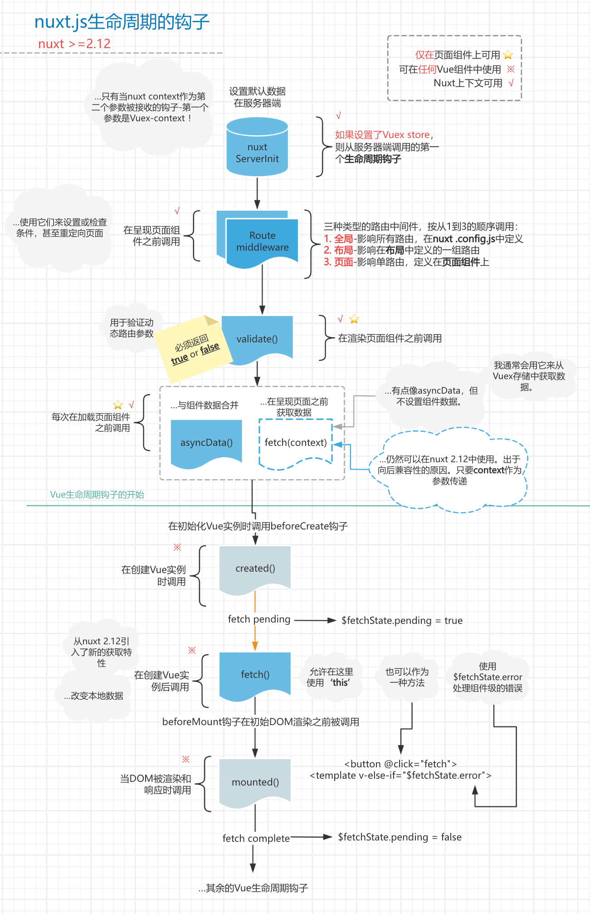

# nuxt2 学习
以下内容记录我自己容易忘记并且官网中不太详细的知识点和从vue-cli项目迁移到nuxt2的思考过程。

#### 如何获取本地存储的数据？

在nuxt中，由于服务端没有`localStorage`，所以无法获取到本地存储的数据，比如`token`，需要通过`cookie`来获取。那么需要通过`cookie-universal-nuxt`这个库来管理以前的本地存储数据。

用法简单

1. 安装`cookie-universal-nuxt`库。
```
npm i cookie-universal-nuxt -S
```
2. 在`nuxt.config.js`modules中配置
```js
modules: [
  'cookie-universal-nuxt'
],
```
3. 获取数据 `$cookies` 。
- `$cookies`参数可以在`nuxtServerInit`生命周期函数中结构出来。
- 可以在自定义的插件`plugins`文件夹下面的如`axios.js`中解构出来。
- 或者在其他生命周期如`created`中通过`this.$cookies`获取。
```js
$cookies.get('token');
```
[具体用法](https://www.npmjs.com/package/cookie-universal-nuxt)


#### 如何使用axios？

安装`@nuxtjs/axios`，[具体用法](https://axios.nuxtjs.org/setup)

用法还是简单的，根据[具体用法](https://axios.nuxtjs.org/setup)就可以。下面就只介绍下全局请求拦截器的设置：

`plugins`文件夹下创建`axios.js`文件
```js
export default ({ $axios, $cookies, store, $config }) => {
  console.log('执行axios');
  console.log('$config', $config);
  console.log('process.env', process.env);
  globalThis.$axios = $axios;
  // console.log('VUE_APP_API_URL', process.env.VUE_APP_API_URL);

  // console.log('process.env.NODE_ENV', process.env);

  /* 请求前置拦截器 */
  $axios.onRequest((config) => {
    // console.log(store.state.token);
    /* 设置请求头 */
    // Adds header: `Authorization: 123` to all requests
    $axios.setToken($cookies.get('token'));
    // $axios.setHeader('Authorization', $cookies.get('token'));

    /* 其实cookie中已经有token信息了，所以实际开发中，后端人员只需要通过cookie中获取token即可 */
    /* 如果后端已经开发好了，需要通过请求头中的Authorization字段来获取token，那么也可以通过上面的代码设置 */
  })
  /* 请求后置拦截器 */
  $axios.onResponse((response) => {
    console.log('后置拦截器');
    return response;
  })
}

```
在`nuxt.config.js`中`plugins`配置
```js
plugins: [
  '~/plugins/axios'
]
```
其中默认导出的函数中可以解构出nuxt给我们准备好的一些参数，如`$axios`，`$cookies`，`store`，`$config`等。通过`$config`配置可以获取到一些环境变量。具体怎么配置下面有介绍。

#### 如何二次封装axios？

我在二次封装axios的时候，去获取`axios`对象的时候，获取不到，以前直接可以通过`import axios from 'axios'`的方式获取，但是这里不行了，我通过`globalThis.$nuxt.$axios`获取，当我以为可以的时候，页面初始化的时候需要请求，此时`globalThis`中没有`$nuxt`，但是打印`globalThis`的时候又有，`$nuxt`属性是什么时候添加到`globalThis`中的还不清楚。所以我自己向`globalThis`对象中添加`$axios`属性，在执行`axios.js`插件的时候。

按照这个思路，那么如果需要获取`store`, `$cookies`,`$config`等参数，也可以按照这样的方式进行获取


#### 如何使用vuex？

在`store`目录下创建`index.js`，在里面定义好`state`，`mutations`，`actions`等。

举个例子
```js
export const state = () => ({
  count: 0,
  token: ''
})
export const mutations = {
  setToken (state, token) {
    state.token = token;
    this.$cookies.set('token', token);
  },
  getToken (state) {
    state.token = this.$cookies.get('token');
    return state.token;
  }
}
export const actions = {
  nuxtServerInit (store, { $cookies }) {
    // store.commit('setToken', 'xxxx11');
    /* 获取cookie中的token设置到仓库中 */
    store.commit('getToken');
    // console.log('$cookies', $cookies);

    console.log('nuxtServerInit11');
  }
}

```
通常在`nuxtServerInit`函数中获取cookie中的token设置到仓库中。不获取也影响不大，比如在请求拦截器中从`$cookies`中获取token数据。


#### 如何添加全局样式？
在`nuxt.config.js`中配置`css`参数。
```js
css: [
  '~/static/css/main.css'
]
```

记得是`main.css`文件需要加在`static`文件夹下的。

如果是scss文件需要预处理的，需要全局样式放到`assets`文件夹下.
安装 `npm i sass sass-loader@10 -D`，`sass-loader` 版本过高有问题。

如果需要全局sass变量，安装[@nuxtjs/style-resources插件](https://www.npmjs.com/package/@nuxtjs/style-resources)，使用步骤里面有。


#### 如何使用element-ui
这个简单，初始化的时候就配置好了，就不写了。

#### 如何使用路由？

这个简单，只需要在pages文件夹下创建一个.vue文件，启动服务就可以加载页面，不需要额外的配置。

[具体用法](https://www.nuxtjs.cn/guide/routing)

路由跳转方式和vue-router一样；

##### 全局导航守卫
方式1：通过中间件的方式。

在中间件文件夹`middleware`中创建auth.js文件，并在`nuxt.config.js`文件中配置，全局导航守卫：

auth.js中做token是否过期的校验。**（经过测试，通过中间件的方式，跳转页面会报错，就不用了，参考插件的方式）**
```js
import { Notification } from 'element-ui';
const WHITE_LIST = ['index', 'news', 'login'];
export default function ({ store, route, replace, redirect, params, query, app: { router } }) {
  console.log('全局执行auth中间件');
  if (!WHITE_LIST.includes(route.name)) {
    if (!store.state.token) {
      Notification.warning('请登录');
      router.push({
        path: '/login',
        query: {
          redirect: route.fullPath
        }
      })
    }
  }
}
```
不过中间件的方式做不到后置全局路由守卫，只能前置。如有需要还是会通过下面插件的方式。

```js
router: {
  /* 全局执行中间件 */
  middleware: 'auth'
}
```

方式2：通过插件的方式。**(我使用的方式)**

`plugins`文件夹下创建`router.js`文件。
```js
import { Notification } from 'element-ui';
/* 白名单页面 */
const WHITE_LIST = ['login'];
export default ({ app, store }) => {
  /* 插件方式实现全局导航守卫 */
  /* 使用中间件的也可以的 */
  app.router.beforeEach((route, from, next) => {
    console.log('路由插件', route);
    if (!WHITE_LIST.includes(route.name)) {
      console.log('需要校验token');
      console.log('store.state.Authorization', store.state);
      // if (!store.state.Authorization) { // 不能这么写，中间会有一瞬间跳转到登录页面
      if (!app.$cookies.get('Authorization')) {
        Notification.warning('请登录');
        console.log(route);
        // next('/login');
        next({
          path: '/login',
          query: {
            redirect: route.fullPath
          }
        });
      } else {
        next();
      }
    } else {
      next();
    }
  })
}

```

在`nuxt.config.js`文件中配置：

```js
plugins: [
  '~/plugins/router.js'
],
```

**注意点**：需要从`$cookies`中获取token。而不是从`store`中获取。原因在`store`中获取会瞬间跳转到登录页面再跳回需要调跳转的页面。

###### 重点强调一下
经过测试，通过中间件的方式进行全局导航守卫，会存在问题，跳转页面会报错，所以我通过`插件的方式`进行做全局导航守卫。


##### 局部导航守卫
在中间件文件夹`middleware`中创建my.js文件,可在具体的页面中设置`middleware`参数为`my`：
```js
<template>
  <div class="x">
    我的
    <nuxt-child />
  </div>
</template>

<script>
export default {
  /* 在页面中执行中间件 */
  middleware: 'my',
  data() {
    return {};
  },
  methods: {}
};
</script>

<style lang='css' scoped>
/* Add your styles here */
</style>

```

#### 如何使用环境变量？

创建`.env`文件，`.env`文件中配置需要的环境变量，比如`BASE_URL`。`NODE_ENV`.

在`vue-cli`中，只有 NODE_ENV，BASE_URL 和以 VUE_APP_ 开头的变量,嵌入到客户端侧的代码中。不过在nuxt中，没有限制`以 VUE_APP_ 开头`。然而`NODE_ENV`是不允许修改的。不过，我们在实际开发中，还是以`VUE_APP_ 开头`，为了**避免和原本的环境变量冲突**。

`.env`：
``` 
# 举例：（这一行是备注）
VUE_APP_NODE_ENV=dev
VUE_APP_URL=http://devapi.xxx.cn
```

如何在代码中获取到环境变量？

通过`process.env.VUE_APP_URL`获取到环境变量。不过通过`process.env`方式获取到环境变量，只能在服务端进行获取，客户端获取不到。

所以需要在`nuxt.config.js`中配置`publicRuntimeConfig`
```js
publicRuntimeConfig: {
  VUE_APP_URL: process.env.VUE_APP_URL,
  VUE_APP_NODE_ENV: process.env.VUE_APP_NODE_ENV
},
```

在组件中获取环境变量：通过`$config`获取到环境变量。
1. `$config`参数可以在`nuxtServerInit`生命周期函数中结构出来。
2. 可以在自定义的插件`plugins`文件夹下面的如`axios.js`中解构出来。
3. 或者在其他生命周期如`created`中通过`this.$config`获取。

`nuxt.config.js`还有一个`privateRuntimeConfig`参数，用户配置仅仅在服务端才能获取到的环境变量。

#### 如何打包上线，流程？
1. 构建项目：`npm run build`
2. 拷贝`.nuxt`,`nuxt.config.js`,`static`,`package.json`，到服务器。
3. 在服务器上执行`npm install`安装依赖。
4. 启动服务：`npm run start`（后续通过`pm2`去启动项目）

上面的流程是看一些教程的，但是实际开发中，会遇到一些问题：
1. 环境变量到哪里获取？
2. `package-lock.json`文件不需要拷贝获取吗？
3. 通过node启动的服务，如何守护进程？
4. 如何配置nginx进行反向代理？


问题1：我的想法是在测试服和正式的对应的创建`.env`文件，配置上自己的环境变量，比如测试服中配置为`VUE_APP_NODE_ENV=dev`，正式服中配置为`VUE_APP_NODE_ENV=prod`。api也是一样配置。

问题2：我觉得`package-lock.json`文件还是要拷贝的，因为里面锁定了小版本。如果不拷贝，相当于代码是没经过测试的。

问题3：通过`PM2`进程管理器，可以做到守护进程。`pm2 --name=nuxt3001 start npm -- run start`，整个命令的作用就是：使用 PM2 启动一个名为 nuxt3001 的 Nuxt.js 应用，通过执行 npm run start 来启动这个应用。这意味着 PM2 将会按照 package.json 中定义的 start 脚本来启动这个 Nuxt.js 应用，并且将此进程标记为 nuxt3001 以便后续管理。

问题4：node部署和页面的部署 在nginx的配置是有所区别的，[查看详情](zh-cn/rearEnd/nginx/nginx)

#### nuxt2的生命周期

[查看详情](https://www.nuxtjs.cn/guides/concepts/nuxt-lifecycle)

下面是翻译的nuxt生命周期图



##### 总结：
1. `nuxtServerInit`生命周期函数在 `store` 中的 `actions` 函数中，可以做获取cookie中的数据，比如token。
2. `Route middleware`路由中间件，设置或检查条件，甚至重定向页面。比如判断是否登录，没有登录则跳转到登录页面，可通过全局中间件配置。
3. asyncData()生命周期函数用于`页面`中获取数据并合并数据到`data`中。
4. fetch()生命周期函数，只操作`vuex`中的数据。不会设置`data`中的数据。
5. created()后面的生命周期函数和vue2中的相同。
6. created()后面有一个fetch函数中获取数据，也可以和以前一样在created()中获取数据是一样的。
7. 从vue-cli项目迁移到nuxt2项目很费劲，就比如数据的获取，如果初始化需要多次请求的时候，需要包在一个Promise.all的静态方法中，改写成本比较大，开发方式的改变也比较大。如果那个页面不需要SEO，那么和以前一样在created()中获取数据就可以了。

##### 疑问：
1. `asyncData`函数不能在组件中使用，那么在组件中获取数据只能通过`fetch`函数，但是`fetch`函数又不能设置`data`中的数据，所以给我的感觉就是子组件中获取数据需要通过props传递进来，但有时候我又想在子组件中获取数据。我测试了下，在`fetch`函数中，通过`this.xxx = 'xxx'`可以修改`data`中数据的。
