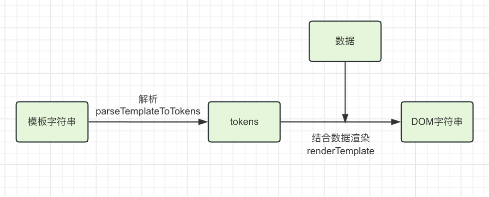
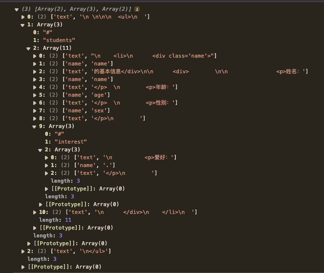
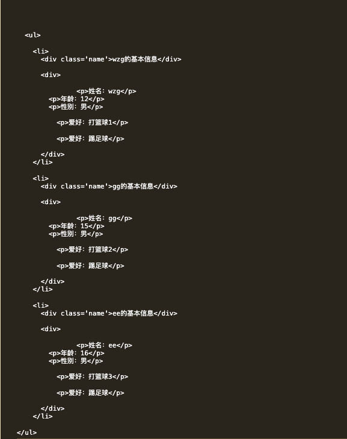

# 历史上出过的数据变成视图的方法
1. 纯DOM方法
2. 数据join方法
3. ES6的反引号法
4. 模板引擎

我就不一一演示用法了，这个在18,19年前的前端开发应该会有印象的。（不过那会好像也没多少前端。。。大多是前后端不分离的），那时做后端3,4经常使用。

# mustache模板引擎

模板引擎是将数据要变成视图`最优雅的解决方法`。

mustache模板引擎运行过程是将模板字符串编译成`tokens`，再和数据结合并解析成`DOM字符串`。



### 什么是tokens？

- `tokens`是一个JS的嵌套数组，说白了，就是模板字符串的JS表现形式。
- 它是“抽象语法树”，“虚拟节点”等等的开山鼻祖。（下一篇AST抽象语法树中有介绍，嵌套的树形结构很像，但表现形式不像。）
- 模板字符串
  `'<h1>我买了一个{{thing}}，好{{mood}}</h1>'`
- 模板字符串解析成 tokens
  ```js
  // tokens的结构
  [
    ["text", "<h1>我买了一个"],
    ["name", "thing"],
    ["text", "，好"],
    ["name", "mood"],
    ["text", "</h1>"]
  ]
  ```

### 生成tokens 
parseTemplateToTokens函数
```js
/**
 * 模板字符串解析成 tokens
 * @param {*} template 
 * @param {*} data 
 */
function parseTemplateToTokens (template, data) {
  // Scanner类没导入，可以在源码中查看具体代码
  const scanner = new Scanner(template);
  const tokens = [];
  while (!scanner.eos()) {
    /* 收集 {{ 前面的文本 */
    tokens.push(['text', scanner.scanUtil('{{')]);
    /* 跳过 {{ */
    scanner.scan('{{');
    /* 收集 {{ 后面的文本 */
    const words = scanner.scanUtil('}}');
    /* 判断 {{ 后面的文本是否为空 */
    if (words !== '') {
      if (words[0] == '#') {
        tokens.push(['#', words.substring(1)]);
      } else if (words[0] == '/') {
        tokens.push(['/', words.substring(1)]);
      } else {
        tokens.push(['name', words]);
      }
    }
    /* 跳过 }} */
    scanner.scan('}}');
  }
  // console.log(tokens);
  return foldTokens(tokens);
  // return tokens;
}
/* 折叠 tokens */
function foldTokens (tokens) {
  let result = [], stack = [];
  for (let i = 0; i < tokens.length; i++) {
    const token = tokens[i];
    if (token[0] === '#') {
      token[2] = [];
      /* 如果#开头，给token下标为2的项创建一个空数组，去收集子节点 */
      stack.push(token);
    } else if (token[0] === '/') {
      /* 如果/开头，将栈顶元素弹出 */
      const data = stack.pop();
      /* 如果栈为空，说明当前token是根节点，
      将token添加到result中,否则将token添加到栈顶元素的下标为2的项中 */
      if (stack.length !== 0) {
        stack[stack.length - 1][2].push(data);
      } else {
        result.push(data);
      }
    } else {
      /* 如果不是#或者/开头，
      如果栈不为空 将token添加到栈顶元素的下标为2的项中，否则将token添加到result中 */
      if (stack.length !== 0) {
        stack[stack.length - 1][2].push(token);
      } else {
        result.push(token);
      }
    }
  }
  return result;
}
```
自行实现的复杂的tokens结果



### 生成dom字符串
renderTemplate函数
```js
/* 是否是对象 */
const isObject = (val) => val !== null && typeof val === 'object';
function renderTemplate (tokens, data) {
  // console.log(tokens, data);
  console.log(data);
  let resultStr = '';
  for (let i = 0; i < tokens.length; i++) {
    const token = tokens[i];

    if (token[0] === 'name') {
      resultStr += lookup(data, token[1]);
    } else if (token[0] === '#') {
      resultStr += parseArr(token[2], lookup(data, token[1]));
    } else {
      resultStr += token[1];
    }
  }
  // console.log(resultStr);
  return resultStr;
}

/* 解析数组 */
function parseArr (token, data) {
  // console.log(data);
  if (!Array.isArray(data)) throw new Error('data is not array');
  let resultStr = '';
  data.forEach((item) => {
    console.log('item', item);
    /* 如果item不是对象，就需要封装成对象，属性名为'.'，属性值为item */
    resultStr += renderTemplate(token, !isObject(item) ? { '.': item } : item);
  })
  return resultStr;
}
```
tokens与数据结合后的DOM字符串




还有个函数有必要写下，以后也可能会用到。 功能是：访问数据`obj.a.b.c`,用该方法可以这样访问数据`obj['a.b.c']`
```js
/**
 * 获取数据
 * @param dataObj
 * @param keyname
 * @returns {*}
 * @example lookup(dataObj, 'a.b.c') => dataObj.a.b.c
 */
function lookup (dataObj, keyname) {
  // console.log(dataObj);
  /* 如果数组中的数据是基本类型，用 '.'标记，则直接返回 dataObj */
  if (keyname.indexOf('.') === -1 || keyname == '.') {
    return dataObj[keyname];
  }
  let keys = keyname.split('.');
  for (let i = 0; i < keys.length; i++) {
    if (dataObj) {
      dataObj = dataObj[keys[i]];
    }
  }
  return dataObj;
}
```

就贴一点代码吧，具体还是打开仓库自己运行看下。

[我的mustache-study地址](https://gitee.com/ctzlwzg/mustache-study)

### 优化空间

模板字符串编译成tokens，再和数据结合并解析成dom字符串，这也就可以变成视图了，但这是整个页面的更新。`无法做到最小量度的更新`。

所以这就引出了`虚拟DOM和diff算法`的内容去解决最小量更新的问题，我自己也很期待后续的学习。

##### 内容来自 [尚硅谷](https://www.bilibili.com/video/BV1EV411h79m/?vd_source=8d218acf3c1a08e1aa351a34c82a444f)，很感谢讲师的分享。后面还有AST抽象语法树，虚拟DOM和diff算法的学习，与大家共勉。

