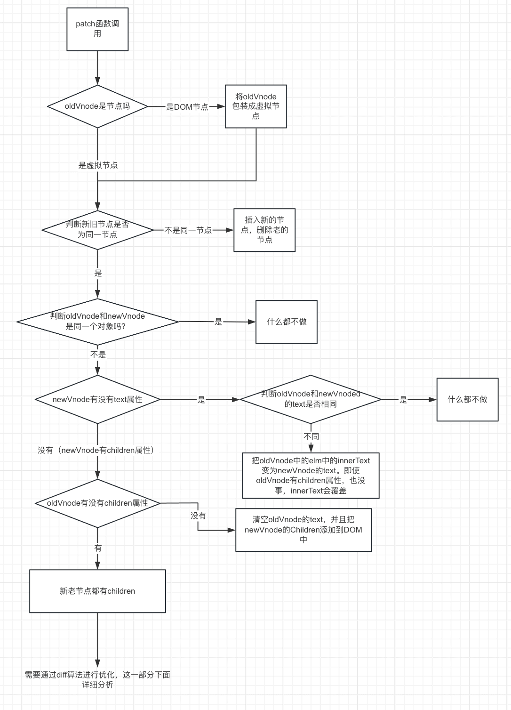

## 什么是虚拟DOM?
虚拟DOM是描述真实DOM节点的对象，通过虚拟DOM可以创建、更新和删除真实DOM。和AST很相似，但是虚拟DOM是描述真实DOM的，而AST是描述源代码的。

### 真实DOM怎么和数据联系在一起？
1. 真实DOM没有途径和数据进行关联，所以需要一个结构与描述DOM结果，根据这个结果来判断数据与真实DOM的关系，这个结构就是虚拟DOM。
2. 数据一变化，真实DOM只有一个方案能更新，就是整个DOM结构重新渲染。

### 为什么需要虚拟DOM和diff算法？
1. vue2,vue3框架设计理念是基于数据驱动，更改了数据，页面就要跟着变。问题来了，数据变化如何和真实DOM关联？记不记得自己实现的mustache模板引擎的生成DOM是整个页面的更新，成本很高，如果我们仅仅只是修改了一个节点，那么页面的更新成本就太大了。所以我们需要一个中间结构，来描述真实DOM，然后根据数据变化，来更新真实DOM。那么这个结构就是虚拟DOM。

2. 虚拟DOM的更新，可以做到局部更新，而不是整个页面更新。做到局部更新，那么就需要一个算法来解决，这个算法就是diff算法，通过比较`新旧的虚拟DOM`，找出差异，然后更新差异部分，来`缓解全局更新带来的性能问题`。（我的理解简单的情况不需要diff，只有是新旧节点都是数组的时候才需要diff算法来优化性能）

3. 抛开vue2和vue3，虚拟DOM和diff算法，不仅仅在浏览器环境中使用，在小程序，移动端，桌面端，node环境中也都可以使用。因为虚拟DOM是一个JS对象，根据不同的环境，去使用虚拟DOM，渲染出界面，就是可以实现一套代码在多端运行。（`跨平台`）

## snabbdom
snabbdom是一个轻量级的虚拟DOM库。

在知乎上有一个问题：“前端开发中有什么经典的轮子值得自己去实现一遍?”那我们就去简单实现下snabbdom。（真的只是简单实现一下哦）


### 什么是h函数？
h函数是用来产生`虚拟节点（vnode）`。

调用h函数：`h('p', { key: 'a', class: { 'box1': true } }, '西瓜')`

生成虚拟节点：
```js
{
  children: undefined,
  data: {
    class: {
      key: 'a'
    }
  },
  elm: undefined,
  key: "a",
  sel: "p",
  text: "西瓜"
}
```

### patch 函数 
patch函数是snabbdom的核心函数，`将虚拟节点渲染成真实节点`。

下面是patch函数的实现流程图：




### 什么是diff算法？
diff算法是`比较新旧虚拟节点，找出差异`，然后`更新差异部分`。

- key是虚拟节点的唯一标识。
- 只有同一个虚拟节点，才进行精细化比较。
- 同一个节点：`key相同`，`选择器相同（sel属性）`
- 只进行`同层比较`，不会进行跨层比较

#### diff算法的优化策略

4个指针：新前，新后，旧前，旧后。
4个节点：新前Vnode，新后Vnode，旧前Vnode，旧后Vnode。

##### 四种命中查找：

!> 如果旧前后节点，新前后节点等于undefined，对应赋值，不进行下面的命中判断

当新前<新后，并且旧前<旧后，那么命中查找：

1. 新前与旧前
  - 比较两个虚拟节点的不同的地方，并上树。
  - 新前虚拟节点的真实节点（elm）赋值为旧前虚拟节点的真实节点（elm）。（用于最后一步的创建节点的插入节点）
  - 匹配的话：新前指针++，旧前指针++。
2. 新后与旧后
  - 比较两个虚拟节点的不同的地方，并上树。
  - 新后虚拟节点的真实节点（elm）赋值为旧后虚拟节点的真实节点（elm）。（用于最后一步的创建节点的插入节点）
  - 匹配的话：新后指针--，旧后指针--。
3. 新后与旧前
  - 比较两个虚拟节点的不同的地方，并上树。
  - 新后虚拟节点的真实节点（elm）赋值为旧前虚拟节点的真实节点（elm）。（用于最后一步的创建节点的插入节点）
  - 移动节点，把旧前的节点移动到旧后节点的后面。
  - 匹配的话：新后指针--，旧前指针++。
4. 新前与旧后
  - 比较两个虚拟节点的不同的地方，并上树。
  - 新前虚拟节点的真实节点（elm）赋值为旧后虚拟节点的真实节点（elm）。（用于最后一步的创建节点的插入节点）
  - 移动节点，把旧后的节点移动到旧前节点的前面。
  - 匹配的话：新前指针++，旧后指针--。

> 命中一种就不在进行命中判断了。

##### 以上4个条件都不满足--->循环 查找新虚拟节点数据，去比对虚拟老节点。
  1. 如果找到了
    - 比较两个虚拟节点的不同的地方，并上树。
    - 找到的节点设置为`undefined`
    - 移动节点，把找到的节点移动到旧前节点的前面。
  2. 如果没找到
    - 新的添加到旧前节点的前面。

  最后需要新前指针++
  
##### 最后还需要判断： 创建或者删除
  - 如果旧节点有，新节点没有
    1. 循环遍历删除旧节点。
  - 如果旧节点没有，新节点有
    1. 循环遍历创建新节点，并添加到新的虚拟节点的新后指针的`+1`项的节点前面。（这里有点难理解的）

[具体代码点击查看](https://gitee.com/ctzlwzg/study-snabbdom)

### 其他处理

事件，属性还未处理。xxx待续