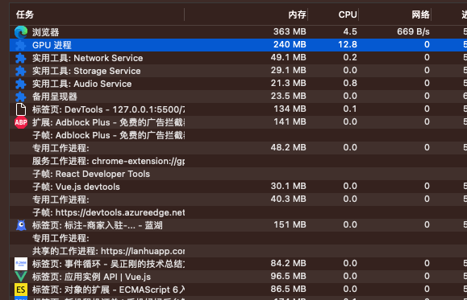
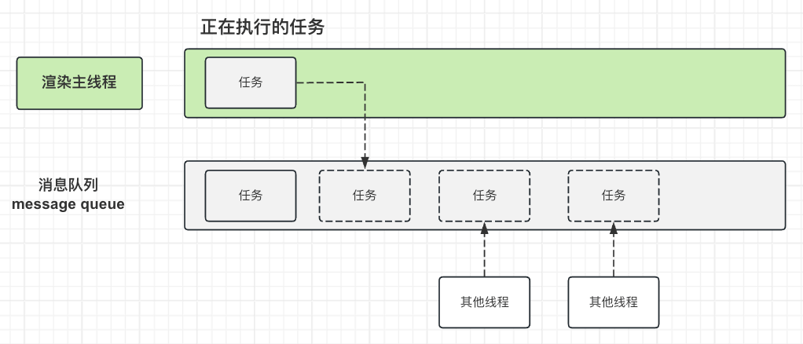
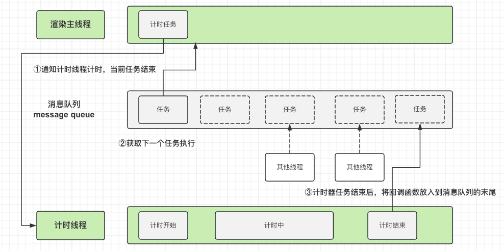
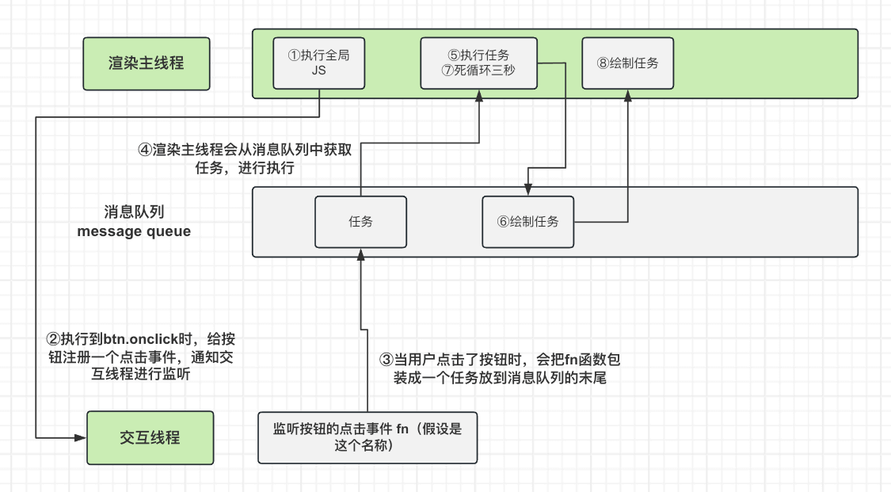

# 事件循环

#### 首先致敬一下 [袁老师](https://space.bilibili.com/666759136)，文章中的内容都是来自袁老师的视频（原视频找不到地址了。。。）

## 浏览器的进程模型

### 何为进程？
程序运行需要有它自己专属的内存空间，可以把这块内存空间简单的理解为进程

### 何为线程？
一个进程至少有一个线程，所以在进程开始后会自动创建一个线程来运行代码，该线程称之为主线程。

如果程序需要同时执行多块代码，主线程就会启动更多的线程来执行代码，所以一个进程中可以有多个线程。

### 浏览器有哪些进程和线程？ 
浏览器是一个多进程多线程的应用程序

浏览器内部工作及其复杂，为了避免相互影响，当启动浏览器后，它会自动启动多个进程

> 可以在浏览器的任务管理器中查看当前的所有进程。



其中，最主要的进程有：
1. 浏览器进程

  主要负责界面显示（比如导航栏，搜索栏，前进后台按钮），用户交互（比如点击了按钮，在搜索栏中输入内容等），子进程管理等。浏览器进程内部会启动多个线程处理不同的任务。
2. 网络进程

  负责加载网络资源。网络进程内部会启动多个进程来处理不同的网络任务。
3. **渲染进程**（下面主要是介绍这个）

  渲染进程启动后，会开启一个渲染主线程，主要负责执行HTML、CSS。JS代码。

默认情况下，浏览器会为每个标签页开启一个新的渲染进程，已保证不同的标签页之间不相互影响。
  
## 渲染主线程是如何工作的？
渲染主线程是浏览器中最繁忙的线程，需要它处理的任务有：

- 解析HTML
- 解析CSS
- 计算样式
- 布局
- 处理图层
- 每秒把页面画60次
- 执行全局JS代码
- 执行事件处理函数
- 执行计时器的回调函数
- ...

> 思考题：为什么渲染进程不使用多个线程来处理这些事情？

要处理这么多的任务，主线程遇到了一个难题：如何调度任务？

比如：

- 我正在执行一个JS函数，执行到一半的时候用户点击了按钮，我该立即执行点击事件去处理函数吗？
- 我正在执行一个JS函数，执行到一半的时候某个计时器到达了时间，我该立即去执行它的回调函数吗？
- 浏览器进程通知我“用户点击了按钮”，与此同时，某个计时器也到达了时间，我应该处理哪一个呢？
- ......

渲染主线程想出了一个方法：`排队`。



1. 在最开始的时候，渲染主线程会进入一个无限循环。
2. 每一次循环会检查消息队列中是否有任务存在，如果有，就取出第一个任务执行，执行完一个后进入下一次循环；如果没有，则进入休眠状态。
3. 其他所有线程（包括其他进程的线程）可以随时向消息队列添加任务。新任务会加到消息队列的末尾。在添加新任务时，如果主线程是休眠状态，则会将其唤醒以继续循环那去任务

这样一来，就可以让每个任务有条不紊的持续的进行下去了，。

**整个过程，被称之为`事件循环`（也叫`消息循环`）**

## 解释三个问题

### 何为异步？

代码在执行过程中，会遇到一些无法立即处理的任务，比如：
- 计时完成后需要执行的任务 `setTimeout` `setInterval`
- 网络请求完成后需要执行的任务 `fetch` `XMLHttpRequest`
- 用户交互完成后需要执行的任务 `click` `mousemove` `keydown`
- ......

如果让渲染主线程等待这些任务的时机到达，就会导致主线程长期处于`阻塞`的状态，从而导致浏览器`卡死`。

**渲染主线程承担着极其重要的工作，无论如何都不能进行阻塞**

因此，浏览器选择异步来解决问题。下面是一个例子：

```js
 setTimeout(() => {
    console.log(1);
  }, 3000);
  console.log(2);
```



1. 计时代码在渲染主线程中执行，通知计时线程进行计时，主线程中的代码打印2后，渲染主线程中的任务就执行完成了。
2. 如果消息队列中任务，就从消息队列中获取新的任务，放到渲染渲染主线程中进行执行
3. 计时线程在计时结束以后，将计时器中的回调函数作为一个任务放入到消息队列的末尾，等待渲染主线程的调用。

> 思考题：如果计时器中的时间为0，打印顺序还是2,1吗？是的还是先打印2，因为计时线程还是会计时只不过计时为0，计时线程在计时结束以后，将计时器中的回调函数作为一个任务放入到消息队列的末尾，等待渲染主线程的调用。

使用异步的方式，**渲染主线程永不阻塞**

#### 面试题：如何理解JS的异步？
JS是一门单线程语言，这是因为它运行在浏览器的渲染主线程中，而渲染主线程只有一个。

而渲染主线程承担着诸多的任务，渲染页面，执行JS，CSS等都在其中进行。

如果使用同步的方式，就极有可能导致主线程产生阻塞，从而导致浏览器卡死。

所以浏览器就采用了异步的方式来避免。具体做法是当某些任务发生时，比如计时，事件监听，网络，主线程会将任务交个其他线程处理，自身立即结束对应任务的执行，转而执行后续的代码。当其他线程完成时，会将事先传递的回调函数包装成一个任务，放入到消息队列的末尾，等待主线程的任务调度。

在这种异步模式下，浏览器永不阻塞，从而最大限度的保证了单线程的顺畅运行。

### JS为何会阻碍渲染?

先看一段代码：
```html
<!DOCTYPE html>
<html lang="en">

<head>
  <meta charset="UTF-8">
  <meta name="viewport" content="width=device-width, initial-scale=1.0">
  <title>Document</title>
</head>

<body>
  <h1>你好！！！</h1>
  <button>改成Hellow</button>
</body>
<script>
  let h1 = document.querySelector('h1');
  let btn = document.querySelector('button');
  /* 死循环指定时间 */
  function delay (duration) {
    var start = Date.now();
    while (Date.now() - start < duration) { }
  }
  /* 点击按钮，修改h1，并且延时2s钟 */
  btn.onclick = function () {
    h1.innerHTML = 'Hellow';
    delay(3000);
  }
</script>

</html>
```



代码分析：

1. 渲染主线程执行全局JS代码。
2. 执行到`btn.onclick`时，给按钮注册一个点击事件，通知交互线程进行监听，渲染主线程中代码执行完毕。
3. 当用户点击按钮时，交互线程将按钮的点击事件回调函数作为一个任务放入到消息队列的末尾，等待渲染主线程的调用。
4. 渲染主线程会从消息队列中获取任务进行执行。
5. 执行代码。这段代码`h1.innerHTML = 'Hellow';`会先设置DOM的文本，但用户并不能立马就能看见。
6. 浏览器需要重新 绘制渲染页面，这个时候产生一个新的任务`绘制任务`，把该任务放在消息队列的末尾。
7. 执行代码`delay(3000);`等待三秒，此时代码会阻塞渲染主线程3秒钟。
8. 渲染主线程执行绘制任务，渲染页面。

> 为什么JS会阻碍渲染，因为JS和渲染，都在渲染主线程中执行。

### 任务有优先级吗？

任务没有优先级，在消息队列中先进先出

但**消息队列是有优先级的**

根据w3c的最新解释：
- 每个任务都有一个任务类型，同一个类型的任务必须在一个队列，不同类型的任务可以分属于不同的队列。在一次事件循环中，浏览器可以根据实际情况从不同的队列中取出任务执行。
- 浏览器必须准备好一个微队列，微队列中的任务优先所有其他任务执行

!> 随着浏览器的复杂度不断提升，W3C不在使用宏队列的说法。

在目前的谷歌浏览器的实现中，至少包含下面的队列：
- 延时队列：用于存放计时器到达后的回调任务，优先级`中`。
- 交互队列：用于存放用户交互事件，优先级`高`。
- 微队列：用于存放需要最快执行的任务，优先级`最高`。

添加微队列的主要有两种方式：
- Promise.resolve().then()
- MutationObserver


举例1：
```js
  setTimeout(() => {
    console.log(1); 
  }, 0);
  Promise.resolve().then(() => {
    console.log(2);
  });
  console.log(3);

```
最终打印顺序为 3 2 1。
原因：微队列的优先级大于延时队列，所以先执行2，再执行1。

加大点难度：
```js
  function a () {
    console.log(1);
    Promise.resolve().then(() => {
      console.log(2);
    });
  }

  setTimeout(() => {
    console.log(3);
  }, 0);

  Promise.resolve().then(a);
  console.log(5);
```
最终打印顺序为 5 1 2 3。

分析：
1. 全局执行JS代码，运行到setTimeout时，通知计时线程计时，0秒后，将回调函数做为一个任务放入到`延时队列`中，等待渲染主线程的调用。
2. 运行到Promise.resolve().then()时，将Promise.resolve().then()的`回调函数`作为一个任务放入到`微队列`的末尾，等待渲染主线程的调用。
3. 打印5
4. 渲染主线程从消息队列中获取任务执行，先从`微队列`中获取任务执行，打印1，运行到Promise.resolve().then()时，将Promise.resolve().then()的`回调函数`作为一个任务放入到`微队列`的末尾，等待渲染主线程的调用。
5. 渲染主线程从消息队列中获取任务执行，**发现`微队列`中还有任务，那么需要优先执行，打印2。**
6. 微队列中没有任务了，那么从延时队列中获取任务执行，打印3

!> 浏览器还有其他很多队列，由于和开发关系不大，就不做考虑

#### 面试题：阐述一下JS的事件循环
事件循环又叫消息循环，是浏览器渲染主线程的工作方式。

在Chrome的源码中，它会开启一个永不会结束的for循环，每次循环都会从消息队列中取出第一个任务执行，而其他线程只需要在合适的时候把任务加入到消息队列的末尾。

过去把消息队列简单的分为宏队列和微队列，这种说法无法满足复杂的浏览器环境，取而代之的是一个更加灵活的方式。

根据w3c官网的解释，每个任务有不同的类型，统一类型必须在同一个队列，不同的任务可以属于不同的队列。不同的任务队列有优先级，在一次事件循环中，由浏览器自行决定取拿一个队列的任务，但必须保证`微队列中的任务先执行`，然后执行其他的队列中的任务（具体顺序，浏览器决定）

必须要有一个微队列。

> 单线程是异步产生的原因。事件循环是异步的实现方式